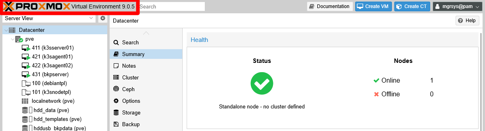
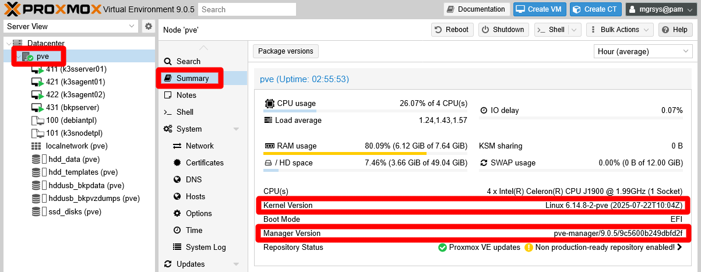
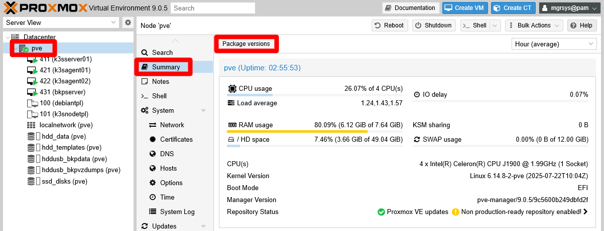
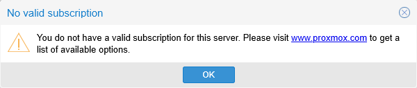
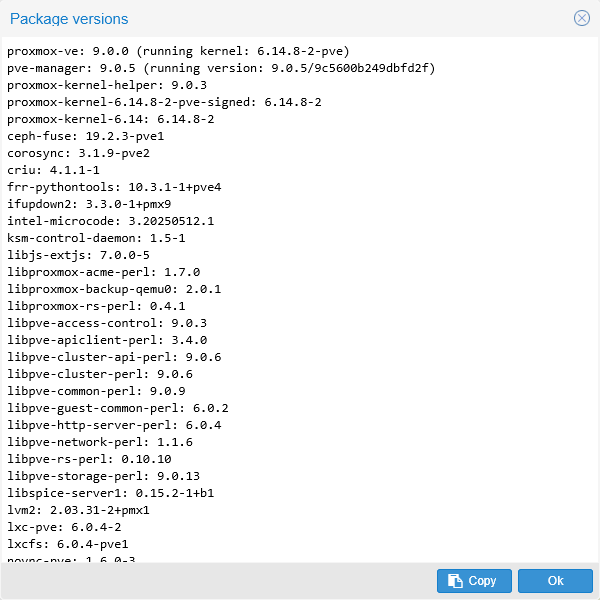
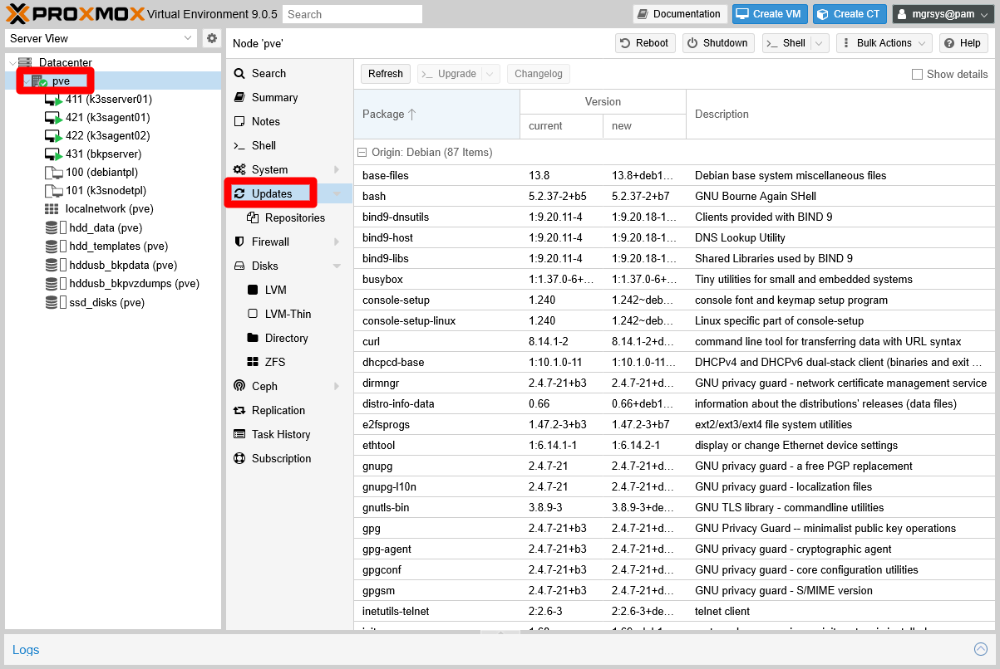
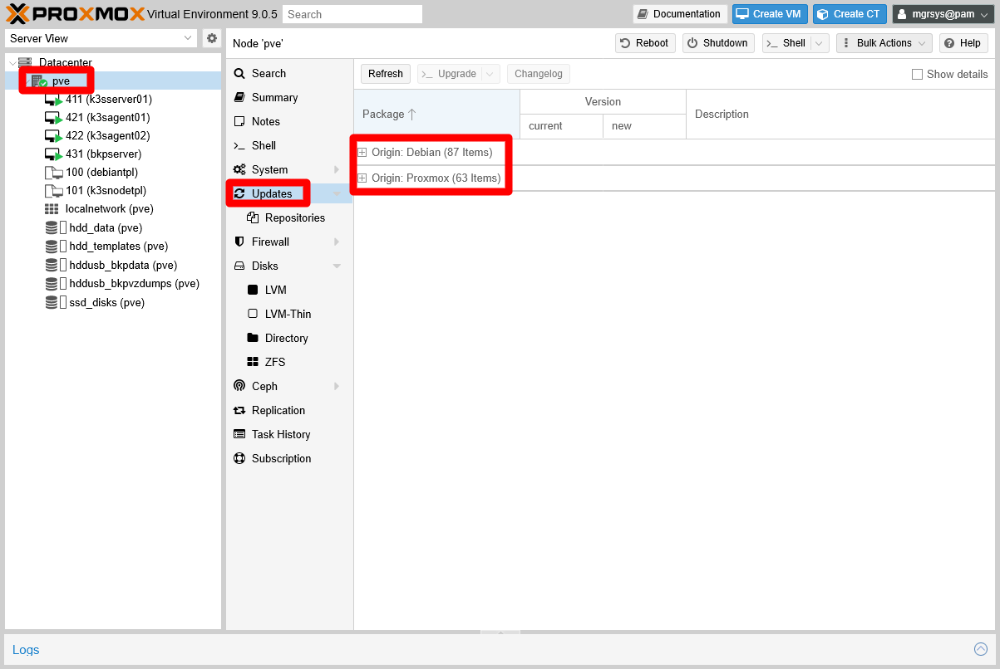
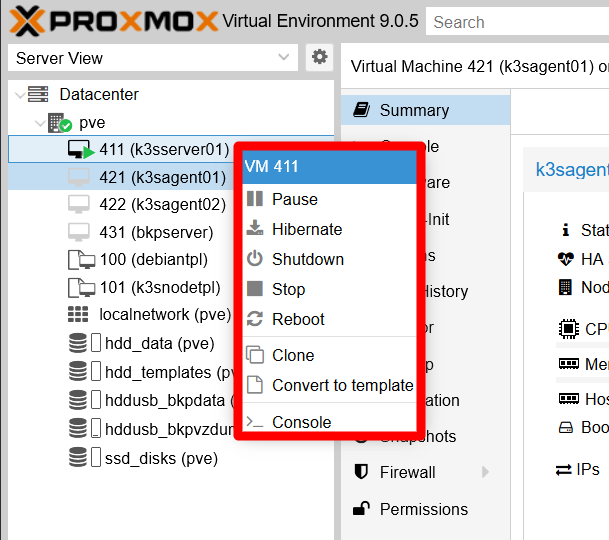
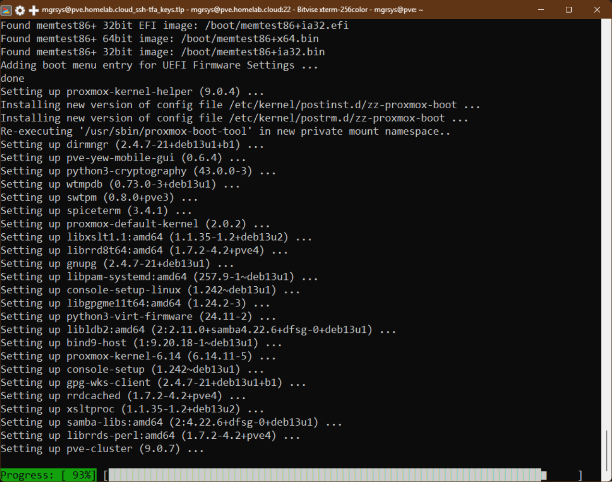
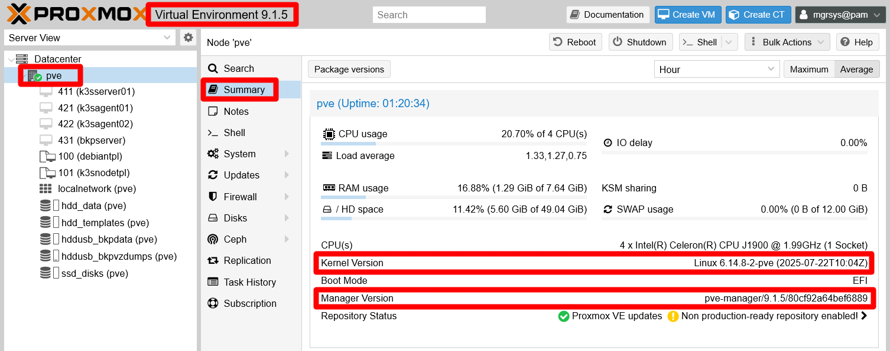

# G043 - System update 02 ~ Updating Proxmox VE

- [Start by updating Proxmox VE](#start-by-updating-proxmox-ve)
- [Examining your Proxmox VE system](#examining-your-proxmox-ve-system)
  - [Proxmox VE's current version](#proxmox-ves-current-version)
  - [Debian packages' current version](#debian-packages-current-version)
  - [_Proxmox VE most recent version_](#proxmox-ve-most-recent-version)
- [Updating Proxmox VE](#updating-proxmox-ve)
  - [Backup your system](#backup-your-system)
  - [Checking the activities on UrBackup](#checking-the-activities-on-urbackup)
  - [Careful with the backup jobs in Proxmox VE](#careful-with-the-backup-jobs-in-proxmox-ve)
  - [Shutting down the VMs](#shutting-down-the-vms)
  - [Starting the masked spiceproxy service](#starting-the-masked-spiceproxy-service)
  - [Applying the updates](#applying-the-updates)
  - [Checking disabled services](#checking-disabled-services)
  - [Restarting the VMs](#restarting-the-vms)
- [References](#references)
  - [Proxmox](#proxmox)
- [Navigation](#navigation)

## Start by updating Proxmox VE

Following the order suggested [in the previous chapter **G042**](G042%20-%20System%20update%2001%20~%20Considerations.md#update-order), start by updating your homelab's Proxmox VE server.

## Examining your Proxmox VE system

To update Proxmox VE, you must be aware first of what version you are using and what updates are available for it. This also implies checking the changes or fixes that come with the updates, and see if anything has been modified dramatically.

### Proxmox VE's current version

To see what version of Proxmox VE you are currently running is really easy. Just get into the PVE web console and take a look at the top bar. There you can see the version number next to the software's name:

In this case, the version reported is `9.0.5`. But you must remember that Proxmox VE is meant to work in a cluster configuration, and could happen that each node of a cluster could have a different version. This particularity means that an administrator must know what version of Proxmox VE is running on each node, and this can be seen in their `Summary` tab. Try it with your standalone `pve` node:

Notice the two highlighted fields:

- `Kernel version`\
  Informs you of the Linux Kernel version you are running. Do not confuse this Kernel version with the release version of the Linux distribution used in the system, which in this case is Debian 13 "trixie".

- `PVE Manager Version`\
  This value indicates the exact Proxmox VE version running in this node. In this case it not only indicates the same version you read in the top bar, but also some extra code (a git repository hexadecimal identifier) that you should not really worry about.

On the other hand, the Proxmox VE software is a collection of packages, each of which have their own version. At the top of the `Summary` page of your `pve` node, there is a `Package versions` button:

Click on this `Package versions` button, and first you are greeted by the warning about not having a "valid subscription" (a paid one) for enterprise updates:

> [!IMPORTANT]
> **The `Package versions` button does not work when the `No valid subscription` is disabled**\
> Be aware of this if you disabled the warning as indicated [in the instructions from chapter **G006**](G006%20-%20Host%20configuration%2004%20~%20Removing%20Proxmox's%20subscription%20warning.md).

Accept the warning so you can reach the next window:

Here you can see the current versions of the packages directly or indirectly related to your Proxmox VE installation. In other words, this window only shows packages that have something to with the Proxmox VE software, filtering out the rest. In particular, notice that, at the top of the list, there's a `proxmox-ve` package and right below it a `pve-manager` one. The `pve-manager` version is the value reported in the `Summary` tab of the `pve` node.

After all this analysis, you can conclude that, in this case, the system is running a Proxmox VE of the **9.0** family.

### Debian packages' current version

Since Proxmox VE is, after all, a custom Debian environment, you also want to know the versions of the rest of the packages installed in your system. To do so, just go to the `Updates` page of your `pve` node:

This view shows you all the packages pending of update, including the Proxmox VE ones. The packages in this view are separated in groups depending on which is their source repository, or `Origin`. You can see this better if you fold all the packages lists:

There are two origins or sources for the packages of this system, the official Debian one and the Proxmox repository.

### _Proxmox VE most recent version_

You know that you have to update your Proxmox VE system, but to what version exactly? The web console does not notify you of upcoming new versions. You have to go to the [official Proxmox page](https://www.proxmox.com/en/) and check there if they have published a new version of Proxmox VE. You can see new versions announced both in their [home page](https://www.proxmox.com/en/), in their [_Press Releases_ page](https://www.proxmox.com/en/about/company-details/press-releases), and in their [_Announcements_ forum](https://forum.proxmox.com/forums/announcements.7/).

For the Proxmox VE `9.0` system updated in this guide, there is a jump to a new minor version `9.1`. In the corresponding announcements, you can see what improvements, fixes and changes bring the new minor version:

- [About. Proxmox Virtual Environment 9.1 available](https://www.proxmox.com/en/about/company-details/press-releases/proxmox-virtual-environment-9-1)
- [Forum. Annoucements. Proxmox Virtual Environment 9.1 available!](https://forum.proxmox.com/threads/proxmox-virtual-environment-9-1-available.176255/)

Since this is a minor version part of the same major 9.x family, updating the Proxmox VE 9.0 system is quite straightforward.

## Updating Proxmox VE

After learning what updates you have to apply, and what they bring, you can start the procedure of updating your Proxmox VE system.

### Backup your system

Upgrading to a newer minor version is a relevant change to the system, in this case from Proxmox VE `9.0` to `9.1`. To remain on the safe side, first you should do a complete host backup with Clonezilla, as is explained in the [chapter **G038**](G038%20-%20Backups%2002%20~%20Host%20platform%20backup%20with%20Clonezilla.md).

### Checking the activities on UrBackup

Check in your UrBackup server's web interface, in the `Activities` tab, if there are backup tasks running. If so, wait for them to finish before you proceed with the rest of this update procedure.

### Careful with the backup jobs in Proxmox VE

Likewise as with UrBackup, if they have started, wait for the backup jobs you may have scheduled in your Proxmox VE system.

### Shutting down the VMs

Being sure that you do not need to use the services provided by the VMs running in your Proxmox VE while upgrading the system, shut them down in the following order:

1. The UrBackup server (`bkpserver`).
2. The K3s agent nodes (`k3sagent01` and `k3sagent02`).
3. The K3s server node (`k3sserver01`).

Know that you have the `Shutdown` action, and several others, in a contextual menu that appears when you click, with your right mouse button, on a VM at the tree on the left:

On the other hand, you do not know how many times you will need to reboot the Proxmox VE host during or after the update. This is relevant to consider because your VMs are configured to start automatically when the host does, and with a big update as the one posed in this guide, you might prefer to temporarily disable this capacity in all your VMs. Remember, this feature is the `Start at boot` parameter found in the `Options` page of your VMs.

### Starting the masked spiceproxy service

Back in the [chapter **G011**](G011%20-%20Host%20hardening%2005%20~%20Proxmox%20VE%20services.md), you disabled certain Proxmox VE services that are not necessary in a standalone PVE node as the one used in this guide. You were also warned [in the same chapter](G011%20-%20Host%20hardening%2005%20~%20Proxmox%20VE%20services.md#errors-in-the-apt-upgrade-process) that some updates of Proxmox VE packages may expect certain services to be running and, if not, the update may warn of an error and not finish correctly.

In particular, the disabled `spiceproxy` service could raise a warning when updating the `pve-manager` package. If you do not want to risk unknown issues during or after the update, you can unmask and start it. Execute the following commands on a remote terminal opened on your Proxmox VE system as `mgrsys`:

~~~sh
$ sudo systemctl unmask spiceproxy.service
$ sudo systemctl start spiceproxy.service
~~~

### Applying the updates

With all the previous steps covered, now you can start the update. First be aware that, although it a fully fledged administrative account, the `mgrsys` user has the `upgrade` button greyed out for some unknown reason in the web console of Proxmox VE 9.0. This forces you to use the `root` user to perform the update as is explained in the [chapter **G003**](G003%20-%20Host%20configuration%2001%20~%20Apt%20sources,%20updates%20and%20extra%20tools.md#update-your-system). You can follow those instructions with the `root` user, or just use `apt` in a remote terminal opened with `mgrsys` as you would do with any Debian-based system:

~~~sh
$ sudo apt update
$ sudo apt upgrade
~~~

Since in this case there are a lot of packages to update, it takes some minutes to finish. Stay put for any questions the upgrade process may ask you:

**When the update process has finished, reboot the host**. After restarting the system, browse back into the web console and go straight to the `Summary` page of your `pve` node:

Notice that now the version is `9.1.5` both in the name at the top bar and in the `Manager Version` field, and that also the `Kernel Version` is newer. Still, check if there are more updates pending and apply them. Remember that you can see this directly in the web console, in the `Updates` page of your `pve` node.

> [!NOTE]
> **Some updates cannot be applied immediately**\
> Although you can see certain updates as available, `apt` can hold them back. Do not worry about them, it means that some other update must arrive at a later date to allow them to be installed in the system.

On the other hand, open a remote terminal with `mgrsys` on your Proxmox VE host and execute the following `apt` command:

~~~sh
$ sudo apt autoremove
~~~

This cleans up any files, like old kernel ones, that `apt` detects as not necessary to keep any more in the system and can be deleted.

### Checking disabled services

It is possible that an update could "resurrect" any of the services you disabled in the [chapter **G011**](G011%20-%20Host%20hardening%2005%20~%20Proxmox%20VE%20services.md). Or maybe they have been changed or even eliminated. Either way you want to check them out to see if they remain disabled and stopped, and you can do that just by checking them with `systemctl`. Below you have a quick command rundown for checking all those services:

- **RPC services**, all related to NFS storage access:

    ~~~sh
    $ sudo systemctl status rpcbind.target rpcbind.socket rpcbind.service
    ~~~

- **ZFS and CEPH services**

    ~~~sh
    $ sudo systemctl status zfs-mount.service zfs-share.service zfs-volume-wait.service zfs-zed.service zfs-import.target zfs-volumes.target zfs.target ceph-fuse.target
    ~~~

- **SPICE proxy service**

    ~~~sh
    $ sudo systemctl status spiceproxy.service
    ~~~

- **Proxmox VE High-Availability (HA) services**

    ~~~sh
    $ sudo systemctl status pve-ha-crm pve-ha-lrm corosync
    ~~~

In this guide's case, just the `spiceproxy.service` is enabled, [done previously in purpose to avoid possible issues](#starting-the-masked-spiceproxy-service). You can disable it again by masking the service with `systemctl`:

~~~sh
$ sudo systemctl mask --now spiceproxy
~~~

When you execute the command above, reboot your system and confirm again that the SPICE proxy and the other listed services remain `disabled` and `inactive (dead)`.

### Restarting the VMs

The last thing to do is to start your VMs if you disabled their `Start at boot` feature before. Boot them up in exactly the opposite order you followed when you shut them down:

1. The K3s server node (`k3sserver01`).
2. The K3s agent nodes (`k3sagent01` and `k3sagent02`).
3. The UrBackup server (`bkpserver`).

Also, do not forget to reenable the `Start at boot` feature found in the `Options` page of all your VMs.

## References

### [Proxmox](https://www.proxmox.com/en/)

- [About. Press Releases](https://www.proxmox.com/en/about/company-details/press-releases)
  - [About. Proxmox Virtual Environment 9.1 available](https://www.proxmox.com/en/about/company-details/press-releases/proxmox-virtual-environment-9-1)

- [Forums](https://forum.proxmox.com/)
  - [Annoucements. Proxmox Virtual Environment 9.1 available!](https://forum.proxmox.com/threads/proxmox-virtual-environment-9-1-available.176255/)

## Navigation

[<< Previous (**G042. System update 01**)](G042%20-%20System%20update%2001%20~%20Considerations.md) | [+Table Of Contents+](G000%20-%20Table%20Of%20Contents.md) | [Next (**G044. System update 03**) >>](G044%20-%20System%20update%2003%20~%20Updating%20VMs%20and%20UrBackup.md)
