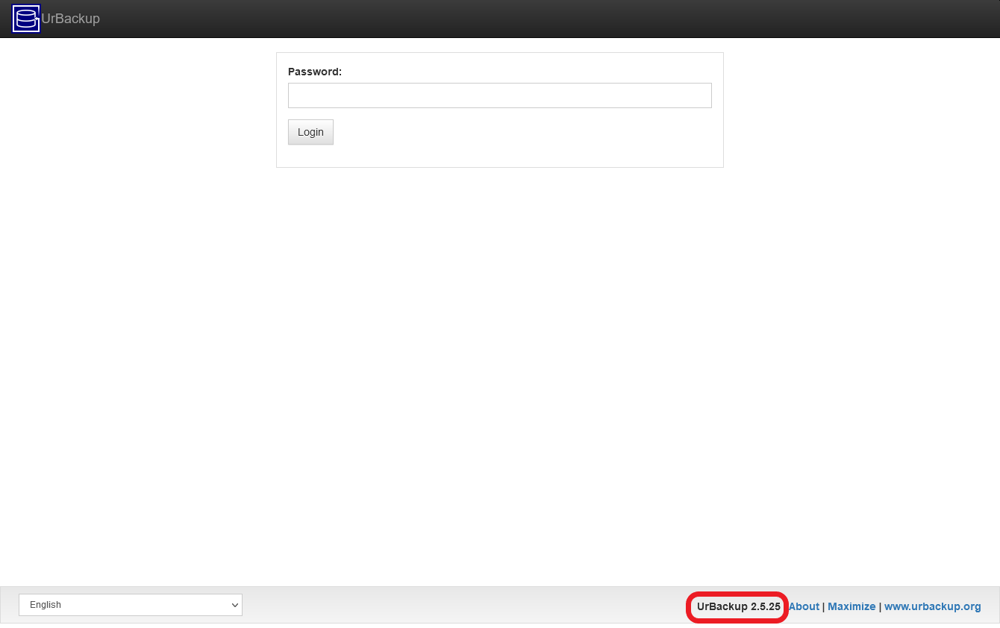

# G044 - System update 03 ~ Updating VMs and UrBackup

In this guide I'll show you how to update the VMs and the UrBackup software. It's not difficult, but this procedure has its own particularities. Be aware that, where I say "update the VMs", what I really mean is to update the Debian operative system running in the VMs.

## Examining your VMs

Like you did with Proxmox VE, you need to know the version of Debian you're currently running on **each** VM. Also, you have to check which version is the latest one of the Debian distribution you're using on your VMs and what changes brings.

### _Debian current version_

To see what version of Debian you're currently running in your VMs, there are a number of ways doing it from the command line. The most useful ones are the following.

1. Opening the file `/etc/debian_version`.

    ~~~bash
    $ cat /etc/debian_version
    11.1
    ~~~

    This value tells you the major (`11`) and minor (`.1`) version of Debian installed, but nothing else.

2. Executing the `uname` command.

    ~~~bash
    $ uname -rsv
    Linux 5.10.0-9-amd64 #1 SMP Debian 5.10.70-1 (2021-09-30)
    ~~~

    This command informs you of the Linux kernel's version running in the system, although doesn't tell you directly what Debian release is. Good to know when updating a system nevertheless.

3. Using the `lsb_release` command.

    ~~~bash
    $ lsb_release -a
    No LSB modules are available.
    Distributor ID: Debian
    Description:    Debian GNU/Linux 11 (bullseye)
    Release:        11
    Codename:       bullseye
    ~~~

    This informs you explicitly about what **major** release of Debian you're using, including its codename. The problem is that it doesn't tell you what **minor** version is.

4. Opening the file `/etc/os-release`.

    ~~~bash
    $ cat /etc/os-release
    PRETTY_NAME="Debian GNU/Linux 11 (bullseye)"
    NAME="Debian GNU/Linux"
    VERSION_ID="11"
    VERSION="11 (bullseye)"
    VERSION_CODENAME=bullseye
    ID=debian
    HOME_URL="https://www.debian.org/"
    SUPPORT_URL="https://www.debian.org/support"
    BUG_REPORT_URL="https://bugs.debian.org/"
    ~~~

    It gives essentially the same version information as the `lsb_release -a` command.

In the example system for this guide series, it happened that the K3s node VMs were running with Debian **11.1**, while the UrBackup server VM had Debian **11.4**.

### _Debian's most recent version_

Go to the [official Debian website](https://www.debian.org/) to discover the current version. In particular, check the latest news, either at the main page or in [the News section](https://www.debian.org/News/). There you'll find the announcements of new versions. At the time of writing this, Debian **11.4** is the most recent version of this distribution. This implied that, in my own system, the oldest VMs were three **minor** versions behind the newest Debian: they had Debian **11.1**, so I had to check out the announcements for the **11.2**, **11.3** and **11.4** versions.

- [Updated Debian 11: 11.4 released](https://www.debian.org/News/2022/20220709)
- [Updated Debian 11: 11.3 released](https://www.debian.org/News/2022/20220326)
- [Updated Debian 11: 11.2 released](https://www.debian.org/News/2021/20211218)

In these announcements, the most common thing to see are bugfixes and security updates, but it may happen that particular packages get removed. There's a good example of this in [the announcement of the **11.4** release](https://www.debian.org/News/2022/20220709). So, don't forget to take a look to these announcements, to be ready for potential dependency conflicts such as missing or deprecated packages.

## Updating Debian on your VMs

You know how old are the Debian systems you have in your VMs now, so let's update them.

### _Backup your VMs_

Either wait for the backup job scheduled in your Proxmox VE to kick in, or launch it manually. Regardless, try to have a fresh backup before updating your VMs, the closest in time you can to the beginning of the update process.

Needless to say that you shouldn't start your update process when a scheduled backup task that affect the VMs is already running, so don't forget to check it in your Proxmox VE web console.

Also remember that, in the system used in this guide, the UrBackup VM is **not included** in the backup scheduled in the [**G039** guide](G039%20-%20Backups%2003%20~%20Proxmox%20VE%20backup%20job.md).

### _Checking the activities on UrBackup_

Check in your UrBackup server's web interface, in the `Activities` tab, if there are backup tasks running. If there are, wait for them to finish before you proceed with the rest of this update procedure.

### _Stop the UrBackup services_

If there's no backup activity in your UrBackup server, it's better to stop the service before executing an update in the system. This is because the UrBackup server software has a couple of package dependencies that might affect it badly if they change while the service is running. Then, open a shell on the `bkpserver` VM as `mgrsys` and stop the UrBackup server.

~~~bash
$ sudo systemctl stop urbackupsrv.service
~~~

The same reason apply to the UrBackup clients installed in the other VMs. Depending on the configuration used, they can have dependencies that could get their packages updated. So, open a shell as `mgrsys` on each of those VMs and stop the client service.

~~~bash
$ sudo systemctl stop urbackupclientbackend.service
~~~

When you've applied the updates and rebooted, those services will be back online automatically.

### _About the K3s services_

Since the K3s software doesn't have any direct dependency on the underlying Debian system, nor is even installed with `apt`, in theory you could leave the K3s services running in your VMs perfectly fine. Of course, that the system where those services are running gets updated somehow influences the K3s cluster, but it's something that you might notice only after rebooting the updated systems.

Either way, know that stopping the K3s services **doesn't stop** the containers themselves, and this is by design. The K3s services in Debian can be stopped like any other regular service.

- Stopping the K3s server.

    ~~~bash
    $ sudo systemctl stop k3s.service k3s-cleanup.service
    ~~~

    See how the server has two services, the regular one and the other for cleaning up pods while gracefully shutting down the cluster.

- Stopping the K3s agents.

    ~~~bash
    $ sudo systemctl stop k3s-agent.service
    ~~~

    If you execute this, remember to do it in **all** your K3s agent nodes.

Know that, in my case, I **didn't** stop the K3s services before applying the updates with `apt` and it went down without any issue.

### _Executing the update with `apt` on all your VMs_

As you already know by now, in Debian you update your packages and, by extension, the system itself with the `apt` command. In **all** of your VMs, execute the following command.

~~~bash
$ sudo apt update
$ sudo apt upgrade
$ sudo reboot
~~~

> **BEWARE!**  
> Like in the upgrade of the Proxmox VE system, this upgrade can ask you about changing configuration files such as the `sshd_config` one. As I told you in the [previous **G043** guide](G043%20-%20System%20update%2002%20~%20Updating%20Proxmox%20VE.md#applying-the-updates), the sensible thing to do is to leave the installed configuration as it is, since switching it for a completely new file would mess up your setup.

After the reboot, give your VMs a few minutes to boot up. Then, don't forget to run the `apt autoremove` command in them for cleaning up any old files may still remain, like older kernel files.

~~~bash
$ sudo apt autoremove
~~~

### _Checking the updated Debian version_

Using the very same commands I [showed you before](#debian-current-version), you can check what Debian release (and what Linux kernel) you have now in your VMs. In the system used in this guide, all VMs have now the same Debian 11.4 system.

1. Seen in the file `/etc/debian_version`.

    ~~~bash
    $ cat /etc/debian_version
    11.4
    ~~~

2. Kernel version checked with the `uname` command.

    ~~~bash
    $ uname -rsv
    Linux 5.10.0-16-amd64 #1 SMP Debian 5.10.127-1 (2022-06-30)
    ~~~

3. Using the `lsb_release` command.

    ~~~bash
    $ lsb_release -a
    No LSB modules are available.
    Distributor ID: Debian
    Description:    Debian GNU/Linux 11 (bullseye)
    Release:        11
    Codename:       bullseye
    ~~~

4. Opening the file `/etc/os-release`.

    ~~~bash
    $ cat /etc/os-release
    PRETTY_NAME="Debian GNU/Linux 11 (bullseye)"
    NAME="Debian GNU/Linux"
    VERSION_ID="11"
    VERSION="11 (bullseye)"
    VERSION_CODENAME=bullseye
    ID=debian
    HOME_URL="https://www.debian.org/"
    SUPPORT_URL="https://www.debian.org/support"
    BUG_REPORT_URL="https://bugs.debian.org/"
    ~~~

Notice that the last two methods show the same values as before, which makes sense since they only inform of the Debian release's major version and codename.

## Updating the UrBackup software

Usually, it shouldn't be a problem that the dependencies the UrBackup software has on Debian get updated. Still, the issue is perfectly possible and this circumstance would force you to upgrade the UrBackup software, although only if there's such update UrBackup available.

On the other hand, those dependencies may limit when you can update your UrBackup software. This means that, although you could have available a new upgrade for the UrBackup server or client, they might require a newer version of their dependencies that is not available in your current Debian major release. Of course, you could fully upgrade your Debian to a new major version, i.e., going from Debian 11.y to Debian 12.y, and that would be it, but sometimes you can't even do this for some odd reason.

Just be aware of those particular circumstances when dealing with updates of software that, like UrBackup, has direct dependencies installed in the underlying operative system.

On the other hand, updating UrBackup is rather simple although not without its own quirks.

### _Beware of the backups_

I've indicated this when dealing with the Debian updates, but it applies just the same when updating UrBackup. Always check first if there are backup jobs running, either in the UrBackup server or the Proxmox VE system. Only when they've finished, proceed with the update of UrBackup.

### _Consider doing a backup of the UrBackup server_

If you have storage space for it, make a backup of the VM manually (unless you already have it scheduled in Proxmox VE). After you've done the update correctly, you can always remove that backup later.

### _Checking the version of UrBackup_

#### **Server version**

To check the version of your UrBackup server is very simple, since you can see it right in the login, at the page's bottom bar.

Above you can see that the UrBackup server is the `2.5.25` version, right the one you saw installed in the [**G040** guide](G040%20-%20Backups%2004%20~%20UrBackup%2001%20-%20Server%20setup.md).

#### **Client version**

The UrBackup client, like any Linux command, has its own `--version` option.

~~~bash
$ urbackupclientctl --version
UrBackup Client Controller v2.5.19.0
Copyright (C) 2011-2019 Martin Raiber
This is free software; see the source for copying conditions. There is NO
warranty; not even for MERCHANTABILITY or FITNESS FOR A PARTICULAR PURPOSE.
~~~

In this case, the client is the `2.5.19` version, the one you deployed with the [G041 guide](G041%20-%20Backups%2005%20~%20UrBackup%2002%20-%20Clients%20setup%20and%20configuring%20file%20backups.md) in all your K3s nodes.

### _UrBackup's most recent version_

The way of being up to date with the latest versions of UrBackup (the `2.5.z` branch in particular) is by checking [this fixed thread](https://forums.urbackup.org/t/server-2-5-25-client-2-5-19-updated/11448) at the [official UrBackup forum](https://forums.urbackup.org/).

### _Updating UrBackup_

#### **UrBackup server update**

The update is exactly the same procedure you used for installing the UrBackup server `.deb` package, which you did in the [**G040** guide](G040%20-%20Backups%2004%20~%20UrBackup%2001%20-%20Server%20setup.md#installing-urbackup-server). And yes, apt won't find automatically the new version because UrBackup server **doesn't** have a source repository for its **2.5.z** branch, forcing you to download the `.deb` file and executing the upgrade manually with `dpkg`.

On the other hand, it's not necessary to stop the UrBackup server service when updating it, like with other services when they're updated with `apt` (`dpkg` is the underlying command that executes the update).

#### **UrBackup client update**

The update of the UrBackup client uses a **different** installer than the one used for install it the first time. The `.sh` executable update is found within a `update` folder in the web folder of the version you want to upgrade to.

For instance, let's say you want to upgrade a `2.5.18` UrBackup client to the `2.5.19` version. The update file to this `2.5.19` version is found within its web folder [here](https://beta.urbackup.org/Client/2.5.19/update/). Get the URL to the .sh file and use it for downloading the file in the system where you want to apply the update.

~~~bash
$ wget https://beta.urbackup.org/Client/2.5.19/update/UrBackupUpdateLinux.sh
~~~

Then, just execute it with `sudo`.

~~~bash
$ sudo sh UrBackupUpdateLinux.sh
~~~

Again, there's no need here to stop the client service.

### _Checking the new versions_

After applying the updates, check the versions of your server and clients [as you saw before](#checking-the-version-of-urbackup). Yet bear in mind that the server may not reflect, in its `Status` page, the new version of the clients immediately.

## References

### _Debian_

- [Debian](https://www.debian.org/)
- [Debian News](https://www.debian.org/News/)
- [Updated Debian 11: 11.4 released](https://www.debian.org/News/2022/20220709)
- [Updated Debian 11: 11.3 released](https://www.debian.org/News/2022/20220326)
- [Updated Debian 11: 11.2 released](https://www.debian.org/News/2021/20211218)
- [How to Check your Debian Linux Version](https://linuxize.com/post/how-to-check-your-debian-version/)
- [6 Ways to get Debian version information](https://vitux.com/get-debian-version/)
- [Using dpkg to install upgrade and dist-upgrade packages](https://askubuntu.com/questions/372153/using-dpkg-to-install-upgrade-and-dist-upgrade-packages)
- [Upgrading/Updating package using dpkg only](https://unix.stackexchange.com/questions/616414/upgrading-updating-package-using-dpkg-only)

### _Urbackup_

- [Official UrBackup forum](https://forums.urbackup.org/)
- [UrBackup 2.5.z branch news thread on official forum](https://forums.urbackup.org/t/server-2-5-25-client-2-5-19-updated/11448)
- [UrBackup Server web folder](https://beta.urbackup.org/Server/)
- [UrBackup Client web folder](https://beta.urbackup.org/Client/)
