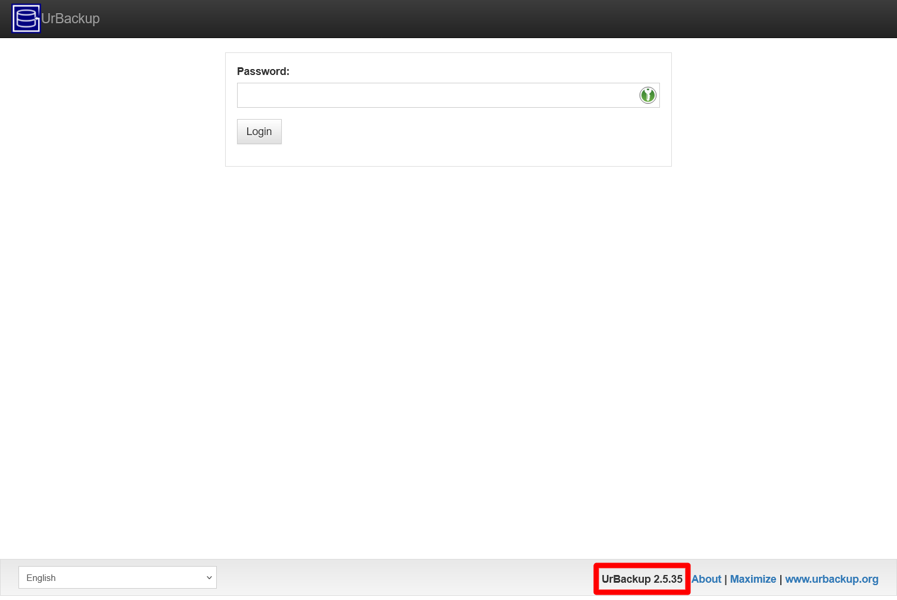

# G044 - System update 03 ~ Updating VMs and UrBackup

- [Updating the VMs means updating their OS](#updating-the-vms-means-updating-their-os)
- [Examining your VMs](#examining-your-vms)
  - [Debian current version](#debian-current-version)
  - [Debian's most recent version](#debians-most-recent-version)
- [Updating Debian on your VMs](#updating-debian-on-your-vms)
  - [Backup your VMs](#backup-your-vms)
  - [Checking the activities on UrBackup](#checking-the-activities-on-urbackup)
  - [Stop the UrBackup services](#stop-the-urbackup-services)
  - [About the K3s services](#about-the-k3s-services)
  - [Executing the update with `apt` on your VMs](#executing-the-update-with-apt-on-your-vms)
  - [Checking the updated Debian version](#checking-the-updated-debian-version)
- [Updating the UrBackup software](#updating-the-urbackup-software)
  - [Beware of the backups](#beware-of-the-backups)
  - [Consider doing a backup of the UrBackup server](#consider-doing-a-backup-of-the-urbackup-server)
  - [Checking the version of UrBackup](#checking-the-version-of-urbackup)
    - [Server version](#server-version)
    - [Client version](#client-version)
  - [UrBackup's most recent version](#urbackups-most-recent-version)
  - [Updating UrBackup](#updating-urbackup)
    - [UrBackup server update](#urbackup-server-update)
    - [UrBackup client update](#urbackup-client-update)
  - [Checking the new versions](#checking-the-new-versions)
- [References](#references)
  - [Debian](#debian)
  - [Other Debian or apt related contents](#other-debian-or-apt-related-contents)
  - [Urbackup](#urbackup)
- [Navigation](#navigation)

## Updating the VMs means updating their OS

This chapter covers how to update the virtual machines and the UrBackup software. It is not difficult, but this procedure has its own particularities. Be aware that, where it says "update the VMs", what it really means is to update the Debian operative system running in the VMs and the software packages installed in them.

## Examining your VMs

Like you did with Proxmox VE, you need to know which version of Debian is currently running **on each VM**. Also, you have to check which version is the latest one of the Debian distribution used on your VMs and what changes brings.

> [!NOTE]
> **All the VMs in your homelab setup should be in the same Debian release version**\
> All the virtual machines created in the Proxmox VE system are clones from the same template. Therefore, at this point, you can safely assume that they are running the same Debian OS.
>
> Still, it is good practice to be sure that your VMs are still aligned. This specially important when doing administrative tasks such as updates manually, it could happen that something gets forgotten.

### Debian current version

To see what version of Debian you are currently running in your VMs, there is a number of ways to do it from the command line. The most useful ones are the following:

1. Opening the file `/etc/debian_version`:

    ~~~sh
    $ cat /etc/debian_version
    13.0
    ~~~

    This value tells you the major (`13`) and minor (`0`) version of Debian installed, but nothing else.

2. Executing the `uname` command:

    ~~~sh
    $ uname -rsv
    Linux 6.12.41+deb13-amd64 #1 SMP PREEMPT_DYNAMIC Debian 6.12.41-1 (2025-08-12)
    ~~~

    This command only informs you of the Linux Kernel's version running in the system. Good to know when updating a system nevertheless.

3. Using the `lsb_release` command:

    ~~~sh
    $ lsb_release -a
    No LSB modules are available.
    Distributor ID: Debian
    Description:    Debian GNU/Linux 13 (trixie)
    Release:        13
    Codename:       trixie
    ~~~

    This informs you explicitly about what major release of Debian running in the VM, including its codename. The problem is that it does not tell you what minor version is.

4. Opening the file `/etc/os-release`:

    ~~~sh
    $ cat /etc/os-release
    PRETTY_NAME="Debian GNU/Linux 13 (trixie)"
    NAME="Debian GNU/Linux"
    VERSION_ID="13"
    VERSION="13 (trixie)"
    VERSION_CODENAME=trixie
    DEBIAN_VERSION_FULL=13.0
    ID=debian
    HOME_URL="https://www.debian.org/"
    SUPPORT_URL="https://www.debian.org/support"
    BUG_REPORT_URL="https://bugs.debian.org/"
    ~~~

    This file has the full release version information of the Debian OS, plus some related links. Notice that this information is set as environment variables that are not loaded in the system.

In this guide's homelab setup, it happened that the K3s node VMs were running with Debian `13.0`, while the UrBackup server VM had its Debian already updated to `13.3`.

### Debian's most recent version

Go to the [official Debian website](https://www.debian.org/) to discover the current version. In particular, check the latest news, either at the main page or in [the News section](https://www.debian.org/News/). There you can find the announcements of new versions. At the time of writing this, Debian **13.3** is the most recent version of this distribution. This implied that, in this guide's system, the oldest VMs were three **minor** versions behind the newest Debian: they had Debian **13.0**, so the announcements for the **13.1**, **13.2** and **13.3** versions also had to be checked:

- [Updated Debian 13: 13.1 released](https://www.debian.org/News/2025/20250906)
- [Updated Debian 13: 13.2 released](https://www.debian.org/News/2025/20251115)
- [Updated Debian 13: 13.3 released](https://www.debian.org/News/2026/20260110)

In these announcements, the most common thing to see are bugfixes and security updates, but it may happen that particular packages get removed. There is an example of package removal in [the announcement of the **13.1** release](https://www.debian.org/News/2025/20250906), published in the section called _Removed packages_. Therefore, do not forget to take a look to these announcements, to be ready for potential dependency conflicts such as removed or deprecated packages.

## Updating Debian on your VMs

After learning how old the Debian systems are in your VMs, get on with their update.

### Backup your VMs

Either wait for the backup job scheduled in your Proxmox VE to kick in, or launch it manually. Regardless, try to have a fresh backup before updating your VMs, the closest in time you can to the beginning of the update process.

Needless to say that you should not start your update process when a scheduled backup task that affect the VMs is already running, so do not forget to check it in your Proxmox VE web console (in `Datacenter > Backup`).

Also remember that, in this guide's setup, **the UrBackup VM is not included** in the backup scheduled in the [chapter **G039**](G039%20-%20Backups%2003%20~%20Proxmox%20VE%20backup%20job.md).

### Checking the activities on UrBackup

Check in your UrBackup server's web interface, in the `Activities` tab, if there are backup tasks running. If there are, wait for them to finish before you proceed with the rest of this update procedure.

### Stop the UrBackup services

If there is no backup activity in your UrBackup server, it is better to stop the service before executing an update in the system. This is because the UrBackup server software has a couple of package dependencies that might affect it badly if they change while the service is running. Then, open a shell on the `bkpserver` VM as `mgrsys` and stop the UrBackup server:

~~~sh
$ sudo systemctl stop urbackupsrv.service
~~~

The same reason apply to the UrBackup clients installed in the other VMs. Depending on the configuration used, they can have dependencies that could get their packages updated. So, open a shell as `mgrsys` on each of those VMs and stop the client service:

~~~sh
$ sudo systemctl stop urbackupclientbackend.service
~~~

When you have applied the updates and rebooted, those services will be back online automatically.

### About the K3s services

Since the K3s software does not have any direct dependency on the underlying Debian system, nor is even installed with `apt`, in theory you could leave the K3s services running in your VMs perfectly fine. Of course, that the system where those services are running gets updated somehow influences the K3s cluster, but it is something that you might notice only after rebooting the updated systems.

Either way, know that stopping the K3s services **does not stop** the containers themselves, and this is by design. The K3s services in Debian can be stopped like any other regular service:

- Stopping the K3s server:

    ~~~sh
    $ sudo systemctl stop k3s.service k3s-cleanup.service
    ~~~

    See how the server has two services, the regular one and the other for cleaning up pods while gracefully shutting down the cluster.

- Stopping the K3s agents:

    ~~~sh
    $ sudo systemctl stop k3s-agent.service
    ~~~

    If you execute this command, remember to do it in **all of your K3s agent nodes**.

Know that, in this guide's case, the K3s services were not stopped before applying the updates with `apt` and they were done without any noticeable issue.

### Executing the update with `apt` on your VMs

As you already know by now, in Debian you update your packages and, by extension, the system itself with the `apt` command:

~~~sh
$ sudo apt update
$ sudo apt upgrade
$ sudo reboot
~~~

Remember to be around, watching the progress of the apt upgrade process since it could throw you a question about some configuration detail affected by the update.

After the reboot, give your VMs a few minutes to boot up. Then, do not forget to run the `apt autoremove` command in each of them for cleaning up any old files still remaining, like older kernel files.

~~~sh
$ sudo apt autoremove
~~~

### Checking the updated Debian version

Using the very same commands [showed before](#debian-current-version), you can check what Debian release (and what Linux kernel) you have now in your VMs. In the case of this guide's setup, all VMs have now the same Debian 13.3 operative system:

1. Seen in the file `/etc/debian_version`:

    ~~~sh
    $ cat /etc/debian_version
    13.3
    ~~~

2. Kernel version checked with the `uname` command:

    ~~~sh
    $ uname -rsv
    Linux 6.12.69+deb13-amd64 #1 SMP PREEMPT_DYNAMIC Debian 6.12.69-1 (2026-02-08)
    ~~~

3. Using the `lsb_release` command:

    ~~~sh
    $ lsb_release -a
    No LSB modules are available.
    Distributor ID: Debian
    Description:    Debian GNU/Linux 13 (trixie)
    Release:        13
    Codename:       trixie
    ~~~

4. Opening the file `/etc/os-release`:

    ~~~sh
    $ cat /etc/os-release
    PRETTY_NAME="Debian GNU/Linux 13 (trixie)"
    NAME="Debian GNU/Linux"
    VERSION_ID="13"
    VERSION="13 (trixie)"
    VERSION_CODENAME=trixie
    DEBIAN_VERSION_FULL=13.3
    ID=debian
    HOME_URL="https://www.debian.org/"
    SUPPORT_URL="https://www.debian.org/support"
    BUG_REPORT_URL="https://bugs.debian.org/"
    ~~~

## Updating the UrBackup software

Usually, it should not be a problem that the dependencies the UrBackup software has on Debian get updated. Still, the issue is perfectly possible and this circumstance would force you to upgrade the UrBackup software, although only if there is such update available.

On the other hand, those dependencies may limit when you can update your UrBackup software. This means that, although you could have available a new upgrade for the UrBackup server or client, they might require a newer version of their dependencies that is not available in your current Debian major release. Of course, you could fully upgrade your Debian to a new major version, for instance, going from Debian 13.y to Debian 14.y, and that would be it, but sometimes you cannot even do this for some odd reason.

Just be aware of those particular circumstances when dealing with updates of software that, like UrBackup, has direct dependencies installed in the underlying operative system.

On the other hand, updating UrBackup is rather simple although not without its own quirks.

### Beware of the backups

As when dealing with the Debian updates, always check first if there are backup jobs running, either in the UrBackup server or the Proxmox VE system. Only when they are finished, proceed with the update of UrBackup.

### Consider doing a backup of the UrBackup server

If you have storage space for it, make a backup of the VM either manually or by scheduling it. After you have done the update correctly, you can always remove that backup later.

### Checking the version of UrBackup

#### Server version

To check your UrBackup server's version is very simple, since you can see it right at the bottom of the login page:

Above you can see that the UrBackup server is the `2.5.35` version, right the one you saw installed in the [chapter **G040**](G040%20-%20Backups%2004%20~%20UrBackup%2001%20-%20Server%20setup.md).

#### Client version

The UrBackup client, like any Linux command, has its own `--version` option:

~~~sh
$ urbackupclientctl --version
UrBackup Client Controller v2.5.29.0
Copyright (C) 2011-2019 Martin Raiber
This is free software; see the source for copying conditions. There is NO
warranty; not even for MERCHANTABILITY or FITNESS FOR A PARTICULAR PURPOSE.
~~~

In this case, the client is the `2.5.29` version, the one deployed with the [chapter **G041**](G041%20-%20Backups%2005%20~%20UrBackup%2002%20-%20Clients%20setup%20and%20configuring%20file%20backups.md) in all your K3s nodes.

### UrBackup's most recent version

To be up to date with the latest versions of UrBackup, go to [its official site](https://www.urbackup.org/) and:

- Look at the versions in the download links. Be aware that those links point to the Windows version of the software.
- Check the _News_ section at the bottom of the page.

### Updating UrBackup

#### UrBackup server update

The update is exactly the same procedure you used for installing the UrBackup server `.deb` package, as done in the [chapter **G040**](G040%20-%20Backups%2004%20~%20UrBackup%2001%20-%20Server%20setup.md#installing-urbackup-server). And no, `apt` cannot find the new version automatically because UrBackup server does not have a source repository, forcing you to download the `.deb` file and executing the upgrade manually with `dpkg`.

On the other hand, it is not necessary to stop the UrBackup server service when updating it, like with other services when they are updated with `apt` (`dpkg` is the underlying command that executes the update).

#### UrBackup client update

According to the [download page of the binary Linux client](https://www.urbackup.org/download.html#linux_all_binary), this client is auto-updated by the UrBackup server when necessary. Therefore, you do not have to worry about updating the client since UrBackup takes care of it automatically.

### Checking the new versions

After applying the updates, check the versions of your server and clients [as you saw before](#checking-the-version-of-urbackup). Bear in mind that the server may not reflect, in its `Status` page, the new version of the clients immediately.

## References

### [Debian](https://www.debian.org/)

- [Latest News](https://www.debian.org/News/)
  - [Updated Debian 13: 13.1 released](https://www.debian.org/News/2025/20250906)
  - [Updated Debian 13: 13.2 released](https://www.debian.org/News/2025/20251115)
  - [Updated Debian 13: 13.3 released](https://www.debian.org/News/2026/20260110)

### Other Debian or apt related contents

- [Linuxize. How to Check your Debian Linux Version](https://linuxize.com/post/how-to-check-your-debian-version/)
- [Vitux. 6 Ways to get Debian version information](https://vitux.com/get-debian-version/)

- [Ask Ubuntu. Using dpkg to install upgrade and dist-upgrade packages](https://askubuntu.com/questions/372153/using-dpkg-to-install-upgrade-and-dist-upgrade-packages)
- [Unix. StackExchange. Upgrading/Updating package using dpkg only](https://unix.stackexchange.com/questions/616414/upgrading-updating-package-using-dpkg-only)

### [Urbackup](https://www.urbackup.org/)

- [Download](https://www.urbackup.org/download.html)
  - [Server. Debian/Ubuntu](https://www.urbackup.org/download.html#server_debian)
  - [Client. Binary Linux client](https://www.urbackup.org/download.html#linux_all_binary)

- [Forums](https://forums.urbackup.org/)

## Navigation

[<< Previous (**G043. System update 02**)](G043%20-%20System%20update%2002%20~%20Updating%20Proxmox%20VE.md) | [+Table Of Contents+](G000%20-%20Table%20Of%20Contents.md) | [Next (**G045. System update 04**) >>](G045%20-%20System%20update%2004%20~%20Updating%20K3s%20and%20deployed%20apps.md)
