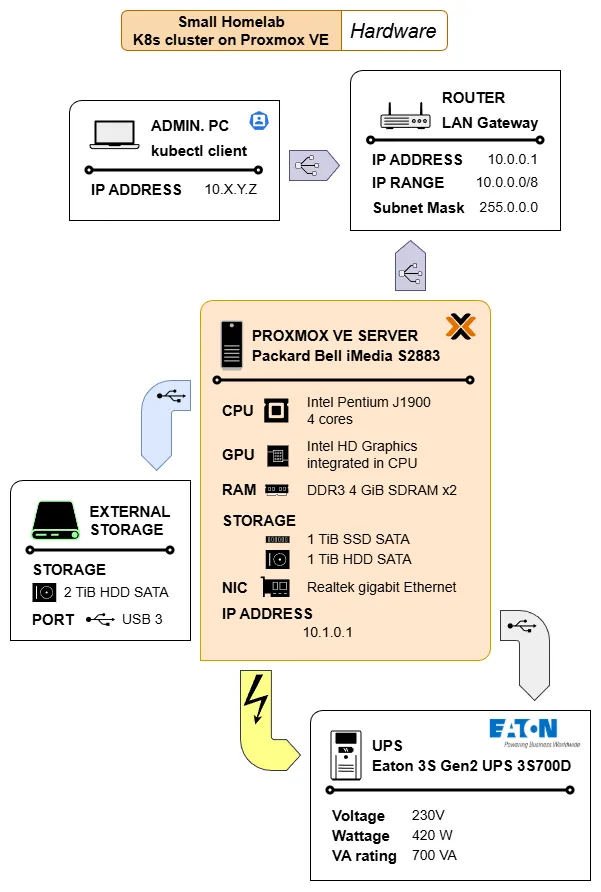
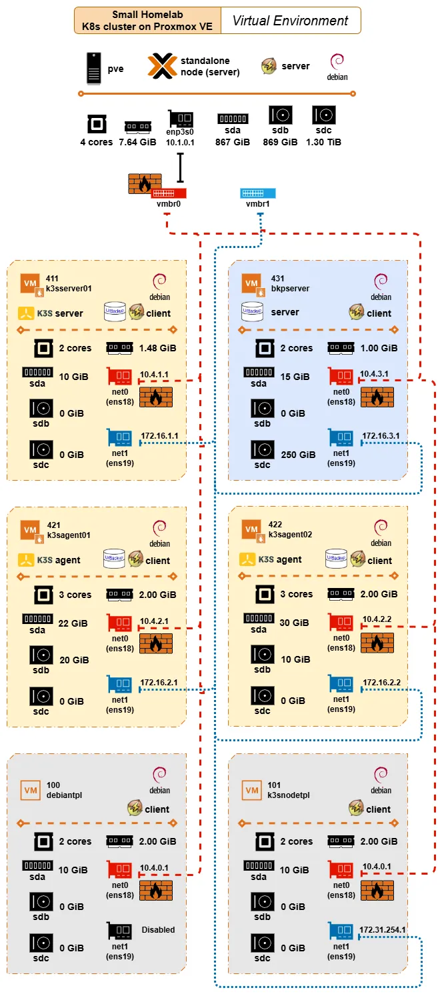
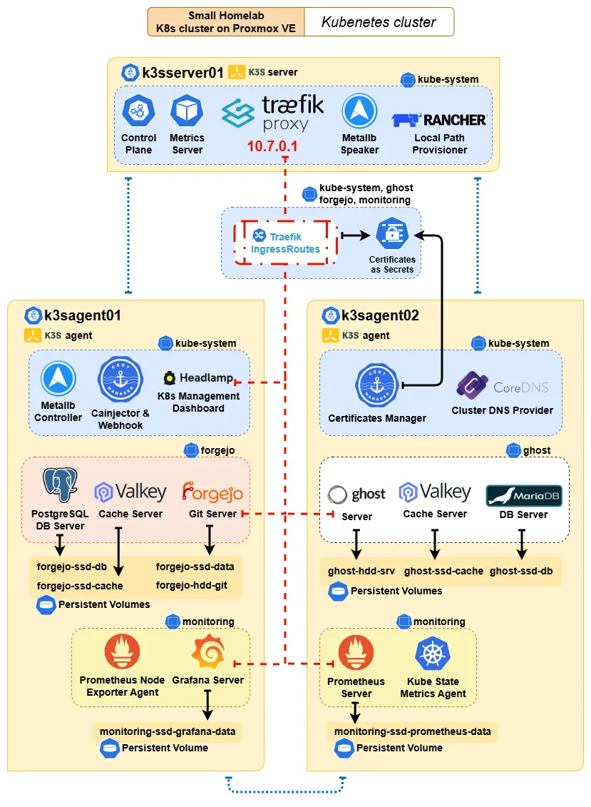

# G047 - Understanding your homelab setup through diagrams

- [This guide's homelab setup is complex](#this-guides-homelab-setup-is-complex)
- [Hardware](#hardware)
- [Virtual environment](#virtual-environment)
- [Kubernetes cluster](#kubernetes-cluster)
- [References](#references)
  - [About Linux bridges in Proxmox VE](#about-linux-bridges-in-proxmox-ve)
- [Navigation](#navigation)

## This guide's homelab setup is complex

If you have done everything explained in this guide, you have ended up with a compact but rather complex homelab system. You may have noticed its nested-doll architecture, organized in these three main layers:

1. [**Hardware**](#hardware)\
    This layer is only about the homelab setup's physical components and how they relate to each other.

2. [**Virtual environment**](#virtual-environment)\
    The Proxmox VE server is the core software element of this layer. It is where all the required virtual machines (_VMs_) are materialized and networked to make the Kubernetes cluster layer possible.

3. [**Kubernetes cluster**](#kubernetes-cluster)\
    The K3s-based Kubernetes (_K8s_) cluster is the layer taking care of the deployment and running practical workloads.

The following sections provide you with diagrams visually explaining these layers, plus some small explanations to help you make sense of what is represented in them.

## Hardware

This layer encompasses the core hardware components involved in this guide's homelab setup:

The diagram also includes the computer used to remotely manage the Kubernetes cluster with the `kubectl` client command. Also notice the icons within the _PROXMOX VE SERVER_ element. Most of them are reused, without the labels, in the diagram illustrating the homelab virtual environment layer.

## Virtual environment

At the virtual environment layer, the complexity of the setup increases:

The diagram shows the main software installed in the computer acting as the Proxmox VE standalone node, and the hardware capabilities available (discounting the space taken by Proxmox VE in the storage units; while the CPU, NIC, and RAM are shared) to the VMs created in this layer. Below are shown the VMs and VM templates created in this virtual environment, and how they are virtually networked through virtual Linux bridges:

- The red dashed line represents the virtual network exposed to the LAN through the Linux bridge `vmbr0`, which is the one "owning" the real NIC `enp3s0` available in the Proxmox VE server.

  Notice how all the `net0` VM interfaces connected to this virtual network are firewalled. The `vmbr0` is also marked as firewalled to represent that the firewall is enabled at the node and datacenter level of Proxmox VE, affecting all communications going through the `enp3s0` NIC.

- The blue dotted line stands for the isolated virtual network used for networking the VMs with each other directly. Since this particular network is not exposed to the outside, the `net1` VM interfaces connected to it are not firewalled.

Regarding the software installed, the diagram indicates how the Proxmox VE server and all VMs are Debian-based. Beyond this detail, the other relevant software installed in the setup configure three different "sublayers":

- **The K3s software installed in the `k3sserver01`, `k3sagent01` and `k3sagent02` VMs makes possible the Kubernetes cluster**\
  It is important to remember that the K3s nodes are connected to both virtual networks: they are reachable from the outside only through the firewalled red network, but communicate with each other only through the isolated blue network.

- **The UrBackup setup has its server installed in the `bkpserver` VM, managing UrBackup clients in all the K3s nodes**\
  Also worth remembering that the UrBackup server is accessible from the LAN through the firewalled red network, while it has been configured to communicate with the UrBackup clients through the isolated blue network.

- **The NUT tooling deployed to monitor and react to the events coming from the UPS unit protecting the whole homelab setup**\
  All the VMs and the templates they are based on have the NUT client installed, while the NUT server is running in the Proxmox VE host. This implies that the NUT clients communicate with the NUT server through the firewalled red network.

  > [!NOTE]
  > **The NUT communications do not go outside the homelab's virtual network**\
  > The NUT clients reach their NUT server directly through the `vmbr0` Linux bridge connecting the VMs with their Proxmox VE host.

## Kubernetes cluster

The Kubernetes (_K8s_) cluster is the most complex layer in this guide's homelab setup, mainly due to the number of software components involved in it. The diagram below gives a simplified view of this layer, showing how its major elements are distributed among the nodes of the K8s cluster:

The details worth highlighting in this diagram are:

- The distribution shown in the diagram is just like a snapshot obtained from one running session. After a reboot, the Kubernetes cluster's control plane can decide to deploy certain components in a different node, changing the picture partially.

- Every component or deployment represented in the diagram is shown in the namespace in which they are deployed.

  - Remember that Persistent volumes **are not namespaced in Kubernetes**, but their claims are. Also that all the persistent volumes used in this guide's homelab setup use local path, tying them down to the nodes where they are enabled.

- Certain critical services are only deployed in the `k3sserver01` server node, like the control plane or Traefik. But there is also the Metallb service which can have its components deployed in any of the nodes.

- Cert-manager's components can be deployed in any of the agent nodes, but not on the server node due to the taint forbidding the deployment of regular workloads in it.

- All the components using persistent storage are tied to the node where their corresponding persistent volume is enabled. In the case of the monitoring stack, the Prometheus and the Grafana servers are tied to their agent nodes while the Prometheus Node Exporter and the Kube State Metrics agents can be deployed in any of the agent nodes.

- The Traefik proxy is the component providing ingress access through the firewalled network enabled in the Proxmox VE standalone node (the red network shown [in the virtual environment diagram](#virtual-environment)).

  - Each reachable app has its own Traefik IngressRoute in their same namespace, and each IngressRoute has its own secret derived from a certificate managed by Cert-manager.

  - Since the Traefik proxy is the gateway for any app accessible through a Traefik IngressRoute, it has assigned (by Metallb) an IP reachable from the outside (the homelab's LAN).

- The internal cluster networking is represented by the blue links connecting the cluster nodes. All the internal cluster communications run through the isolated network enabled in the Proxmox VE standalone node (the blue network shown [in the virtual environment diagram](#virtual-environment)).

- Most Kubernetes objects involved in this setup, like Persistent Volume Claims or Services, are omitted to avoid cluttering the diagram. The same is true about the lack of lines representing the internal communications among the different components of this setup. Assume all those communications happen in the isolated blue network interconnecting the nodes.

## References

### About Linux bridges in Proxmox VE

- [What is vmbr0 in proxmox?](https://hub.sivo.it.com/proxmox-networking-component/what-is-vmbr0-in-proxmox/)

## Navigation

[<< Previous (**G046. Cleaning up your homelab system**)](G046%20-%20Cleaning%20up%20your%20homelab%20system.md) | [+Table Of Contents+](G000%20-%20Table%20Of%20Contents.md) | [Next (**G901. Appendix 01**) >>](G901%20-%20Appendix%2001%20~%20Connecting%20through%20SSH%20with%20PuTTY.md)
