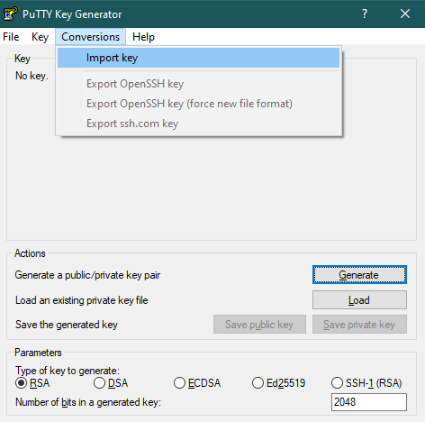
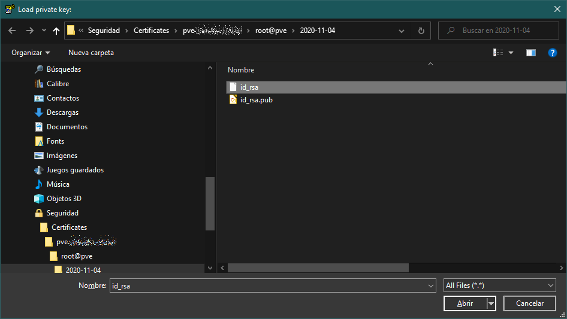
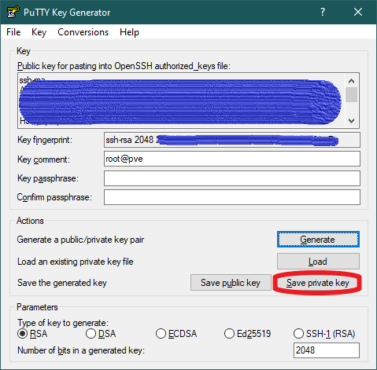
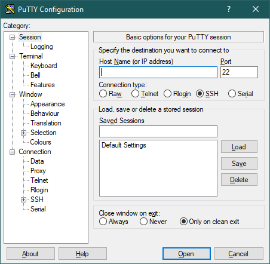
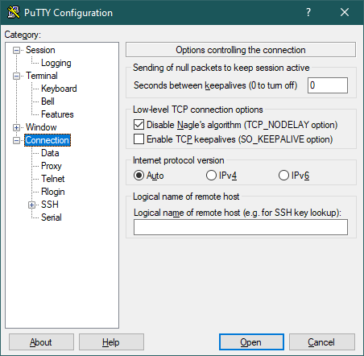
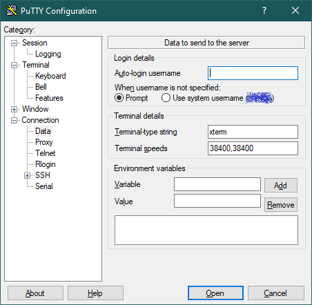
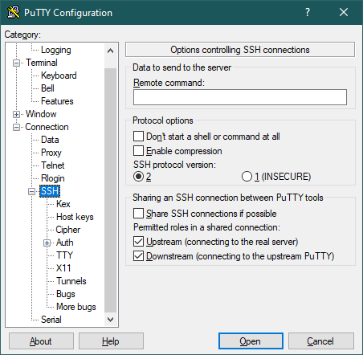
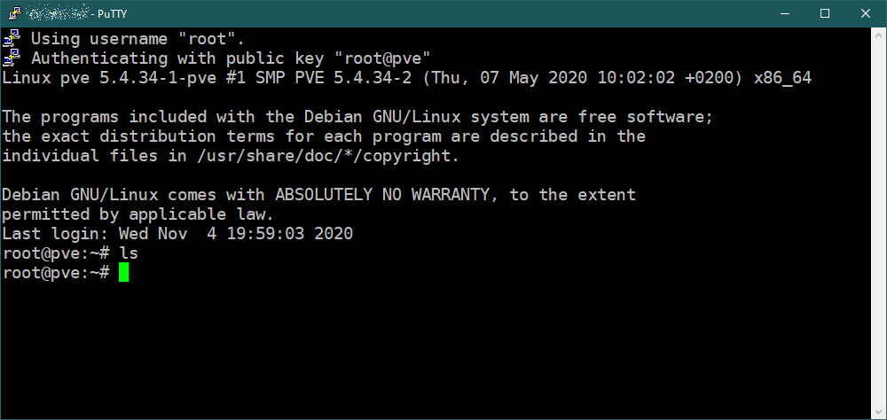

# G901 - Appendix 01 ~ Connecting through SSH with PuTTY

> **BEWARE!**  
> The following instructions may be centered in PuTTY on Windows, but most clients of its kind will require the same (or a very similar) configuration to connect with your PVE node. Therefore, these instructions could also be somehow valid for them.

## Generating `.ppk` file from private key

1. Convert the private key of your pve user into a format that can be used by PuTTY (and other Windows-based clients). Open the `Putty Key Generator` utility (`PuTTYgen`) and choose the `Conversions > Import key` option.

    

    It will show you a explorer window where you'll have to locate the user's `id_rsa` **private** key file you should have recovered already from the PVE node after generating it.

    

2. With the private key loaded in the PuTTYgen utility, now you can convert it into a `.ppk` file. Just press on the `Save private key` button and PuTTYgen will ask you where you want to save the `.ppk` file.

    

    > **BEWARE!**  
    > When you save the private key, PuTTYgen will raise a warning if the private key doesn't have a **Key passphrase**. Careful with this, since if you added a passphrase now, the private key and its public counterpart **would change**!

    Save the file with the name `id_rsa.ppk` in the same folder you have the other keys already stored in your system, so you have everything together in the same place.

    > **OPTIONAL**  
    > You could also use the `Save public key` button, but this will store the **same** public key you got from the pve node. The only difference will be in the content format and in the `Newline` character used (it will be the _Windows_ one).

## Configuring the connection to the PVE node

1. The first thing to consider is the `.ppk` file you've got for the user you want to connect with:

    - You've got it saved in a certain location of your personal computer or laptop which may be in a typical **hard drive**. If your computer also happens to have an SSD, consider making a copy of that `.ppk` into an `.ssh` folder in your user profile directory (`C:\Users\YourUserName\.ssh`). This is just for the sake of a little better performance. Now, bear in mind that the `.ssh` folder may not exist and you should create it first. Realize that here we're making the assumption that your Windows is installed in that SSD unit.

    - If you follow the previous recommendation, you should also consider renaming the copied `.ppk` file to something more detailed like `username@pve_fqdn_private_rsa.ppk`. This is to avoid confusion with other certificates you may end placing in the same `.ssh` folder later.

2. After you've decided where to place the user's `.ppk` file and how to name it, now you can use it to connect with the pve node through PuTTY. Start PuTTY and you'll see its main window.

    

    In this window you just need to set a few parameters:

    - **Host Name**: put here the ip address of your Proxmox VE system, it might be like something `192.168.1.110`.
    - **Port**: the value presented by default is the correct one, `22`.
    - **Saved Sessions**: here you must put a name for this session, so you can save the configuration and use it later. Put something meaningful like `PVE@username`. Notice how I placed the node denomination before the user name, this will help with ordering when you have different sessions for different systems.

    Once you've configured those values, press on `Save` and you'll see how this new session appears in the list of **Saved Sessions**, right under `Default Settings`.

3. Next to do is to configure the SSH certificate and other extra parameters. In PuTTY, press on the `Connection` branch in the options tree.

    

    In the screen above, you might find useful to enable the following options to avoid the Proxmox's Debian kills your remote session (although **that is a security feature**):

    - **Seconds between keepalives**: value in _seconds_ that indicates when a putty session has to send a _keepalive package_ to the other end. Please put a reasonable number of seconds here, something between **60** and **300**.

    - **Enable TCP keepalives**: you must also check this option on.

4. Now press on the `Connection > Data` suboption and you'll see the following screen.

    

    Here, and just for convenience, set the **Auto-login username** parameter with your user's username. This way, you won't ever need to type it for the sessions opened with this configuration.

5. Press on the `Connection > SSH` suboption and you'll open the screen below.

    

    There are two options here that you might find interesting to enable:

    - **Enable compression**: this will compress the data transmitted between the client and the server.

    - **Share SSH connections if possible**: enable this to avoid login again when you already have an open session with a certain user. This way you'll be able to open several different remote terminal sessions under the same login.

6. Click on the `Connection > SSH > Auth` suboption. This is the screen in which you must indicate the location to your user's `.ppk` private key file.

    

    Notice the textbox with a `Browse` button under the title **Private key file for authentication**. Press the Browse button and locate your private key there. There's no need to change anything else in this screen.

7. Press on the `Session` option to go back to the screen below.

    

    In your case it should be still filled with the details of your new session. Press on the `Save` button to save all the changes made to this session configuration.

8. Finally, click on the `Open` button present at the bottom of the PuTTY window, next to the `Cancel` one. This will connect you to the `pve` node on your Proxmox VE server although, in this first time, PuTTY will raise the following security alert.

    

    This is nothing to worry about, its just PuTTY telling you that it doesn't know the ssh fingerprint of the server it's connecting to and is asking you about accepting and remembering it. Just press on `Yes` (`Sí` in my spanish locale setting) and you should get into the shell.

    

    > **NOTE**  
    > You might notice that the font on my PuTTY shell window is different from what you see in yours. This is because I configured it this way on PuTTY, in the `Window > Appearance` screen.

## References

### _List of **SSH clients**_

- [PuTTY](https://www.putty.org/)
- [mRemoteNG](https://mremoteng.org/)
- [Bitvise](https://www.bitvise.com/)
- [WinSCP](https://winscp.net)

### _About the **newline**_

- [Newline](https://en.wikipedia.org/wiki/Newline).
- [Why does Linux use LF as the newline character?](https://unix.stackexchange.com/questions/411811/why-does-linux-use-lf-as-the-newline-character)
- [Difference between CR LF, LF and CR line break types?](https://stackoverflow.com/questions/1552749/difference-between-cr-lf-lf-and-cr-line-break-types)

## Navigation

[<< Previous (**G046. Cleaning the system**)](G046%20-%20Cleaning%20the%20system.md) | [+Table Of Contents+](G000%20-%20Table%20Of%20Contents.md) | [Next (**G902. Appendix 02**) >>](G902%20-%20Appendix%2002%20~%20Vim%20vimrc%20configuration.md)
