# G901 - Appendix 01 ~ Connecting through SSH with PuTTY

- [These instructions could be valid for other remote terminal clients](#these-instructions-could-be-valid-for-other-remote-terminal-clients)
- [Generating a `.ppk` file from a private key](#generating-a-ppk-file-from-a-private-key)
- [Configuring the connection to the PVE node](#configuring-the-connection-to-the-pve-node)
- [References](#references)
  - [Remote terminal clients](#remote-terminal-clients)
  - [About the newline](#about-the-newline)
- [Navigation](#navigation)

## These instructions could be valid for other remote terminal clients

The instructions in this appendix may be centered around PuTTY on Windows, but most clients of this kind will require the same (or a very similar) configuration to connect with your PVE node. Therefore, these instructions could also be somehow valid for them.

## Generating a `.ppk` file from a private key

You need to convert the private key of your `root` or `mgrsys` user into a `.ppk` file that PuTTY (and other Windows-based clients) can read:

1. Open the `Putty Key Generator` utility (`PuTTYgen`) and choose the `Conversions > Import key` option:

    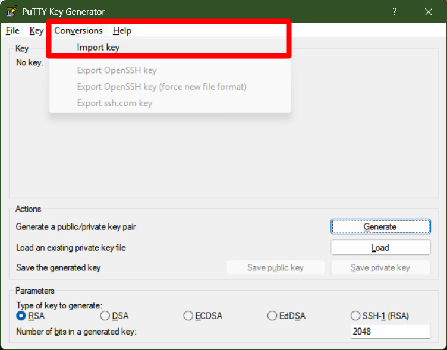

    It will show you a explorer window where you have to locate the user's `id_ed25519` private key file you should have recovered already from the PVE node after generating it:

    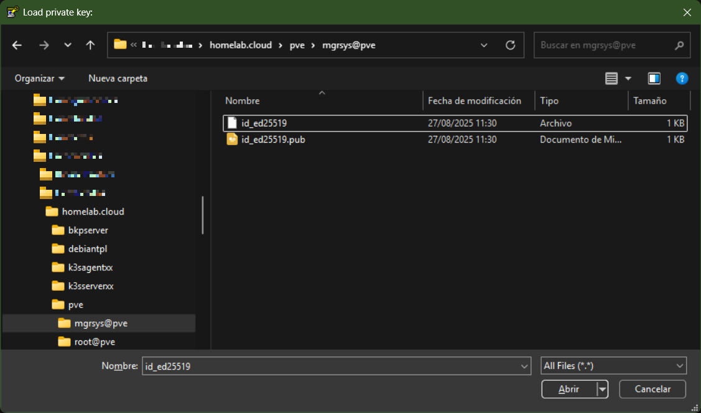

2. With the private key loaded in the PuTTYgen utility, now you can convert it into a `.ppk` file. Just press on the `Save private key` button and PuTTYgen will ask you where you want to save the `.ppk` file:

    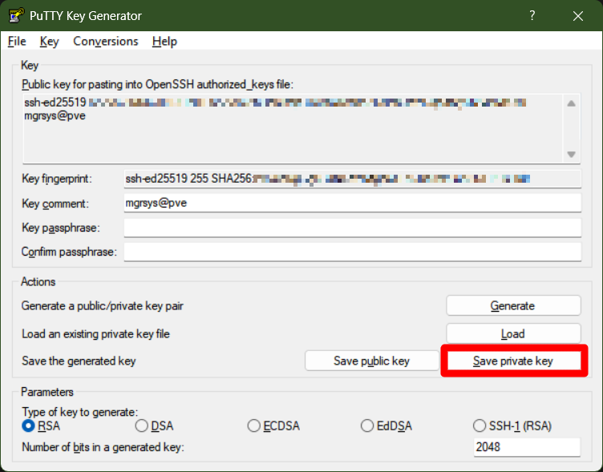

    > [!IMPORTANT]
    > **The key-pair changes if you add a passphrase**\
    > When you save the private key, PuTTYgen will raise a warning if the private key does not have a key passphrase. Careful with this, since if you added a passphrase now, the private key and its public counterpart would change!

    Save the file with the name `id_ed25519.ppk` in the same folder you have the other keys already stored in your system. This way you keep everything together in the same place.

    > [!NOTE]
    > **Saving the public key makes little difference**\
    > You could also use the `Save public key` button, but this will store the same public key you got from the pve node. The only difference will be in the content format and in the `Newline` character used (it will be the _Windows_ one).

## Configuring the connection to the PVE node

The PuTTY interface is "old school", which makes setting up a remote SSH connection in it somewhat counterintuitive:

1. Start PuTTY and you will see its main window:

    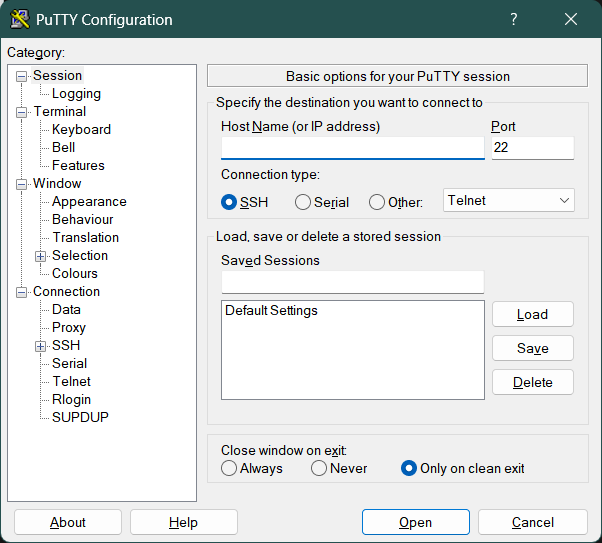

    In this window you just need to set a few parameters:

    - `Host Name`\
      Put here the IP address of the remote system you want to connect to, like your homelab's Proxmox VE server.

    - `Port`\
      The default value `22` here is the correct one, which is the default port for SSH connections.

    - `Saved Sessions`\
      Here you must enter a name for this session to save the configuration and use it later. Put something meaningful like `username@servername.domain.name`. For saving a connection configuration for the `mgrsys` user in the Proxmox VE server built in this guide, the name would be `mgrsys@pve.homelab.cloud`.

    Once you have configured those values, press on `Save` and this new session will appear in the list of `Saved Sessions`, right under the `Default Settings` entry:

    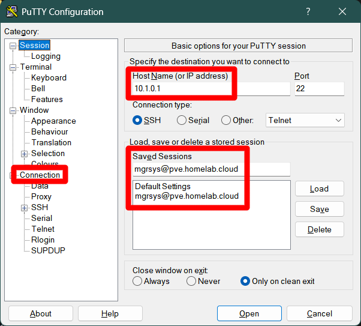

2. Next to do is to configure the SSH certificate and other extra parameters. In PuTTY, click on the `Connection` branch in the options tree:

    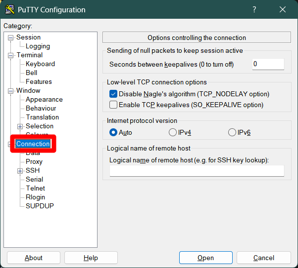

    In the screen above, you have options to avoid the killing of your session due to inactivity by the remote server you connect to. In other words, you can keep your session alive automatically, although remember that this session killing is a security measure:

    - `Seconds between keepalives`\
      Value in _seconds_ that indicates when a putty session has to send a _keepalive package_ to the other end. Please put a reasonable number of seconds here, something between 60 and 300.

    - `Enable TCP keepalives`\
      Check this option on to enable the keepalive feature.

    After applying this keepalive configuration, this window would look like this:

    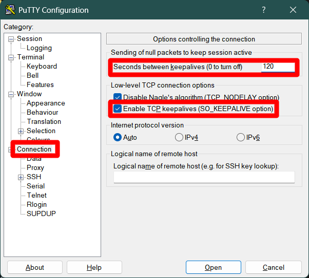

3. Go to the `Connection > Data` submenu:

    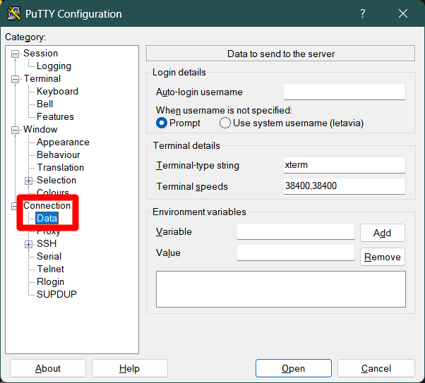

    Here, and just for convenience, set the `Auto-login username` field with your user's username. This way, you will not ever need to type it for the sessions opened with this configuration. For instance, to login with the `mgrsys` user:

    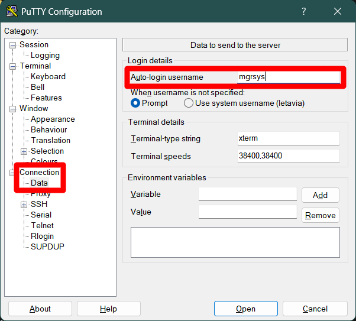

4. Click on the `Connection > SSH` submenu:

    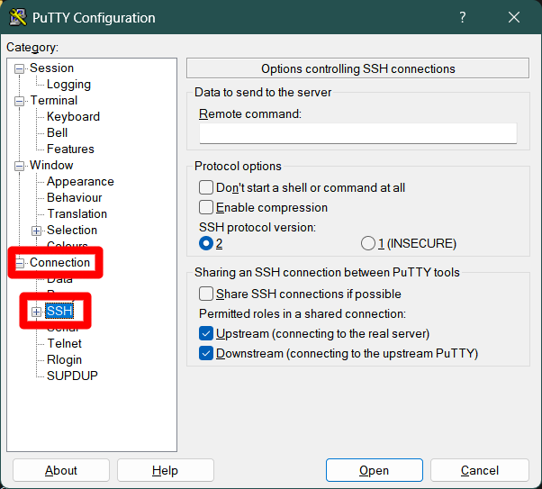

    There are two options here that you might find useful to enable:

    - `Enable compression`\
      This will compress the data transmitted between the client and the server.

    - `Share SSH connections if possible`\
      Enable this to avoid login again when you already have an open session with a certain user. This way you can open several different remote terminal sessions under the same login.

    With these options enabled, the window looks like this:

    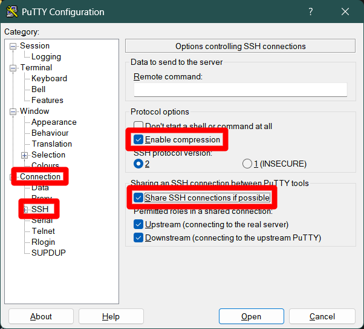

5. Unfold and click on the `Connection > SSH > Auth > Credentials` submenu. Here is where you must locate your user's `.ppk` private key file:

    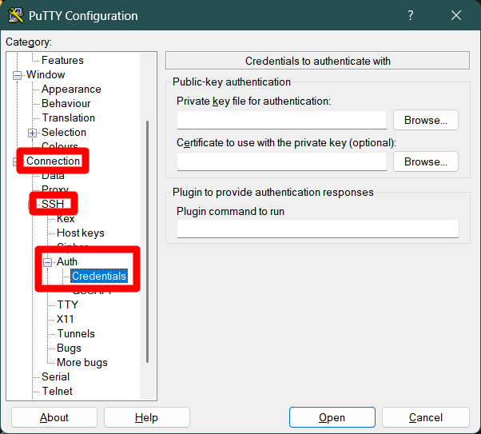

    Press the `Browse` button next to the `Private key file for authentication` and locate your private key there. There is no need to change anything else in this screen:

    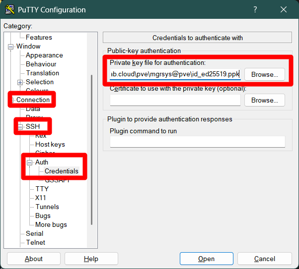

6. Return to the `Session` menu:

    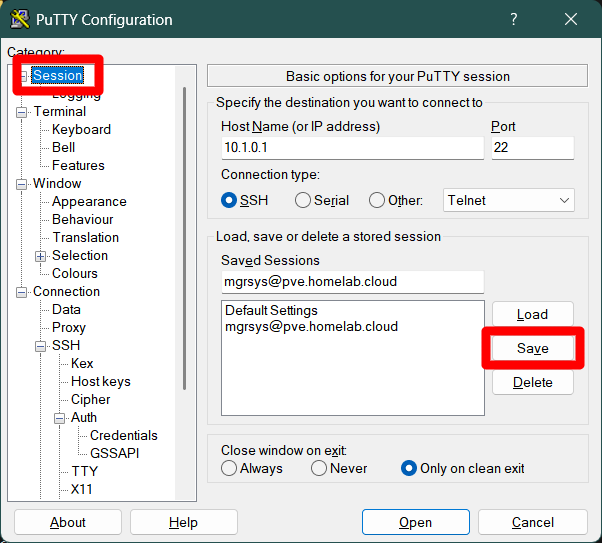

    It should still have loaded the details of the session you saved earlier. Press on the `Save` button to save all the changes made to this session configuration.

7. Finally, click on the `Open` button present at the bottom of the PuTTY window, next to the `Cancel` one:

    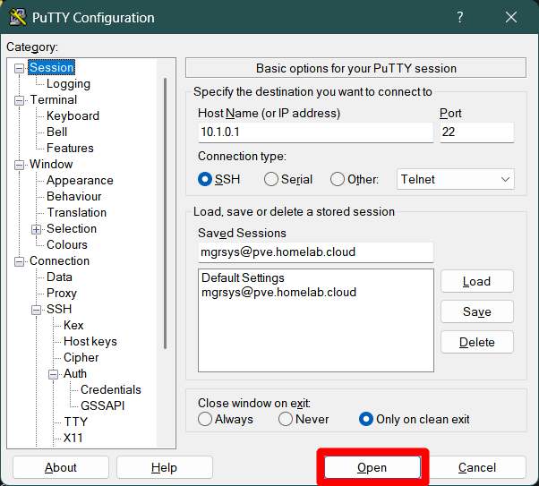

    This will connect you to the remote server you may have configured. In this example, it is the Proxmox VE server of this guide's homelab setup. The first time you connect to the remote server, PuTTY will raise the following security alert:

    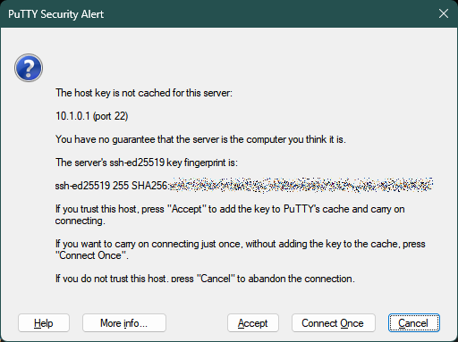

    This is PuTTY telling you that it does not know the SSH fingerprint of the server it is connecting to and is asking you to recognize and accept it so PuTTY can remembering it for future connections. If you are sure about the server you are connecting to, press on `Accept` and you should finally get into the shell:

    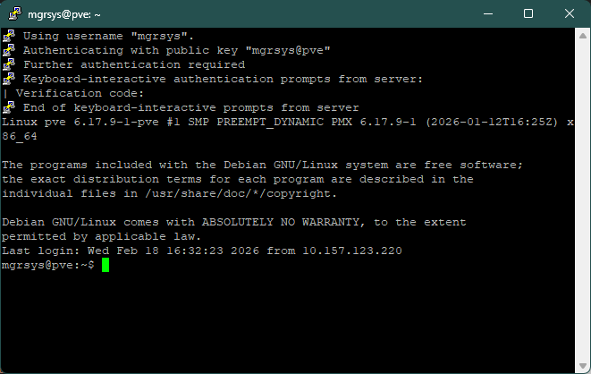

## References

### Remote terminal clients

- [Bitvise](https://www.bitvise.com/)
- [mRemoteNG](https://mremoteng.org/)
- [Putty](https://putty.software/)
  - [PuTTY: a free SSH and Telnet client](https://www.chiark.greenend.org.uk/~sgtatham/putty/)
- [WinSCP](https://winscp.net)

### About the newline

- [Wikipedia. Newline](https://en.wikipedia.org/wiki/Newline).
- [StackExchange. Unix. Why does Linux use LF as the newline character?](https://unix.stackexchange.com/questions/411811/why-does-linux-use-lf-as-the-newline-character)
- [StackOverflow. Difference between CR LF, LF and CR line break types?](https://stackoverflow.com/questions/1552749/difference-between-cr-lf-lf-and-cr-line-break-types)

## Navigation

[<< Previous (**G047. Understanding your homelab setup through diagrams**)](G047%20-%20Understanding%20your%20homelab%20setup%20through%20diagrams.md) | [+Table Of Contents+](G000%20-%20Table%20Of%20Contents.md) | [Next (**G902. Appendix 02**) >>](G902%20-%20Appendix%2002%20~%20Vim%20vimrc%20configuration.md)
