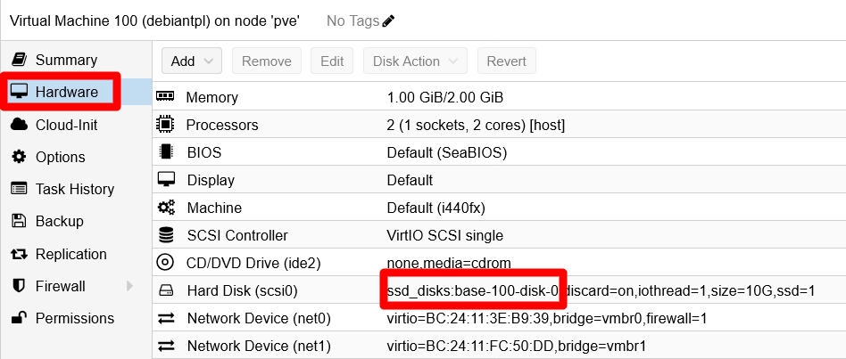

# G904 - Appendix 04 ~ Handling VM or VM template volumes

- [VM hard disks are disk images](#vm-hard-disks-are-disk-images)
- [Installing the `libguestfs-tools` package](#installing-the-libguestfs-tools-package)
- [Locating and checking a VM or VM template's hard disk volume](#locating-and-checking-a-vm-or-vm-templates-hard-disk-volume)
  - [Getting information about your VMs' hard disk volumes with already available tools](#getting-information-about-your-vms-hard-disk-volumes-with-already-available-tools)
  - [Learn more about your VMs' hard disk volumes with libguestfs](#learn-more-about-your-vms-hard-disk-volumes-with-libguestfs)
- [Relevant system paths](#relevant-system-paths)
  - [Directories on Proxmox VE host](#directories-on-proxmox-ve-host)
  - [Files on Proxmox VE host](#files-on-proxmox-ve-host)
- [References](#references)
  - [Tools for handling of VM disk images](#tools-for-handling-of-vm-disk-images)
  - [Contents about handling of VM disk images](#contents-about-handling-of-vm-disk-images)
- [Navigation](#navigation)

## VM hard disks are disk images

The hard disks attached to a virtual machine or a VM template are, in fact, VM disk images. In the case of [the Debian VM created in the chapter **G020**](G020%20-%20K3s%20cluster%20setup%2003%20~%20Debian%20VM%20creation.md#building-a-debian-virtual-machine), its hard disk is an image that has been created as a LVM light volume within a thinpool. This way, the disk image is not just a file, but a virtual storage device that contains the VM's entire filesystem. How to locate and, when necessary, handle such an image in your Proxmox VE server?

## Installing the `libguestfs-tools` package

The Proxmox VE web console only gives you a very limited range of actions, like creation or size enlargement, to perform over any VM's hard disks. Also, there is in your system the `qemu-img` command to manipulate these images, but it is also kind of limited. A much more powerful command toolkit for handling VM disk images is the one provided by the `libguestfs-tools` package:

1. The `libguestfs-tools` package does not come installed in the Proxmox VE server. Open a remote shell in your PVE server and install it with `apt`:

    ~~~sh
    $ sudo apt install -y libguestfs-tools
    ~~~

    This package's installation will execute a considerable number of actions and install several dependencies, so you'll see a lot of output lines on this process.

2. Installing `libguestfs-tools` package does quite a lot of things in your Proxmox VE host. Better reboot your system right after the installation is finished:

    ~~~sh
    $ sudo reboot
    ~~~

The `libguestfs-tools` package comes with a big set of commands enabling you to handle VM disk images in complex ways. Check them out in the documentation available at [libguestfs' official page](https://libguestfs.org/).

## Locating and checking a VM or VM template's hard disk volume

To obtain information of your VMs' hard disk volumes, you can use the Proxmox VE web console and the other tools the server already had. But, to go deeper you will need to use the libguestfs toolkit.

### Getting information about your VMs' hard disk volumes with already available tools

First, locate and learn about a VM or VM template hard disk volume with the tools you already had in your Proxmox VE host:

1. In the Proxmox VE web console, go to a VM template's `Hardware` view (in this case, [the `debiantpl` one](G023%20-%20K3s%20cluster%20setup%2006%20~%20Debian%20VM%20template%20and%20backup.md)), and read the `Hard Disk` line:

    

    Remember the `ssd_disks:base-100-disk-0` string, it is the name of the hard disk volume within your Proxmox VE node.

2. Open a remote terminal, as your administrator `mgrsys` user, to your Proxmox VE host and execute the following `lvs` command:

    ~~~sh
    $ sudo lvs -o lv_full_name,pool_lv,lv_attr,lv_size,lv_path,lv_dm_path
      LV                       Pool           Attr       LSize   Path                          DMPath
      hddint/hdd_data                         twi-aotz-- 869.00g                               /dev/mapper/hddint-hdd_data
      hddint/hdd_templates                    -wi-ao----  60.00g /dev/hddint/hdd_templates     /dev/mapper/hddint-hdd_templates
      hddint/vm-421-disk-0     hdd_data       Vwi-aotz--  20.00g /dev/hddint/vm-421-disk-0     /dev/mapper/hddint-vm--421--disk--0
      hddint/vm-422-disk-0     hdd_data       Vwi-aotz--  10.00g /dev/hddint/vm-422-disk-0     /dev/mapper/hddint-vm--422--disk--0
      hddusb/hddusb_bkpdata                   twi-aotz--  <1.27t                               /dev/mapper/hddusb-hddusb_bkpdata
      hddusb/hddusb_bkpvzdumps                -wi-ao---- 560.00g /dev/hddusb/hddusb_bkpvzdumps /dev/mapper/hddusb-hddusb_bkpvzdumps
      hddusb/vm-431-disk-0     hddusb_bkpdata Vwi-aotz-- 250.00g /dev/hddusb/vm-431-disk-0     /dev/mapper/hddusb-vm--431--disk--0
      pve/root                                -wi-ao---- <50.00g /dev/pve/root                 /dev/mapper/pve-root
      pve/swap                                -wi-ao----  12.00g /dev/pve/swap                 /dev/mapper/pve-swap
      ssdint/base-100-disk-0   ssd_disks      Vri---tz-k  10.00g /dev/ssdint/base-100-disk-0   /dev/mapper/ssdint-base--100--disk--0
      ssdint/base-101-disk-0   ssd_disks      Vri---tz-k  10.00g /dev/ssdint/base-101-disk-0   /dev/mapper/ssdint-base--101--disk--0
      ssdint/ssd_disks                        twi-aotz-- 867.00g                               /dev/mapper/ssdint-ssd_disks
      ssdint/vm-411-disk-0     ssd_disks      Vwi-aotz--  10.00g /dev/ssdint/vm-411-disk-0     /dev/mapper/ssdint-vm--411--disk--0
      ssdint/vm-421-disk-0     ssd_disks      Vwi-aotz--  10.00g /dev/ssdint/vm-421-disk-0     /dev/mapper/ssdint-vm--421--disk--0
      ssdint/vm-421-disk-1     ssd_disks      Vwi-aotz--  10.00g /dev/ssdint/vm-421-disk-1     /dev/mapper/ssdint-vm--421--disk--1
      ssdint/vm-421-disk-2     ssd_disks      Vwi-aotz--   2.00g /dev/ssdint/vm-421-disk-2     /dev/mapper/ssdint-vm--421--disk--2
      ssdint/vm-422-disk-0     ssd_disks      Vwi-aotz--  10.00g /dev/ssdint/vm-422-disk-0     /dev/mapper/ssdint-vm--422--disk--0
      ssdint/vm-422-disk-1     ssd_disks      Vwi-aotz--  10.00g /dev/ssdint/vm-422-disk-1     /dev/mapper/ssdint-vm--422--disk--1
      ssdint/vm-422-disk-2     ssd_disks      Vwi-aotz--  10.00g /dev/ssdint/vm-422-disk-2     /dev/mapper/ssdint-vm--422--disk--2
      ssdint/vm-431-disk-0     ssd_disks      Vwi-aotz--  10.00g /dev/ssdint/vm-431-disk-0     /dev/mapper/ssdint-vm--431--disk--0
    ~~~

    In the `lvs` output above, you can see your VM template's hard disk volume named as `ssdint/base-100-disk-0`. This means that it is a volume within the `ssdint` LVM volume group you created back in the [chapter **G005**](G005%20-%20Host%20configuration%2003%20~%20LVM%20storage.md#creating-a-new-partition-and-a-new-vg-in-the-unallocated-space-on-the-sda-drive). Not only that, in the `Pool` column you see the name `ssd_disks`, which refers to the LVM thinpool you created in the [chapter **G019**](G019%20-%20K3s%20cluster%20setup%2002%20~%20Storage%20setup.md#creating-the-logical-volumes-lvs). The next `Attr` column gives you some information about the volume itself:

    - `V` indicates that the volume is _virtual_.
    - `r` means that this volume is _read-only_.
    - `i` refers to the storage allocation policy used in this volume, in this case is _inherited_.
    - `t` means that this volume uses the thin provisioning driver as _kernel target_.
    - `z` indicates that newly-allocated data blocks are overwritten with blocks of (z)eroes before use.
    - `k` is a flag to make the system skip this volume during activation.

    > [!NOTE]
    > **The `Attr` column has more values**\
    > The values in the `Attr` column are called `lv_attr` bits. Check them out in the _Notes_ section of the `lvs` manual (command `man lvs`).

    Next to the `Attr` column, you can see the size assigned to the volume, 10 GiB in this case, although this number is just logical.

    And what about the columns `Path` and the `DMPath` of the `lvs` output? They are the paths to the handler files (symbolic links) used by the system to manage the light volumes. You can see them with the `ls` command, except the ones used for the `base-100-disk-0` volume. Since this volume is not active (remember the `k` flag in the `Attr` column), you will not find the corresponding files present in the system.

    In conclusion, with the storage structure you have setup in your system, mostly based on LVM thinpools, all of your VMs hard disk volumes will be virtual volumes within LVM thinpools. In the case of your VM template's sole hard disk, the concrete LVM location is as follows:

    - Volume Group `ssdint`.
    - Thinpool `ssd_disks`.
    - Light Volume `base-100-disk-0`.

    Remember that, in this scenario, the `ssdint` VG corresponds to an entire physical LVM volume set within the `/dev/sda4` PV. This PV shares the real underlying ssd unit with the `/dev/sda3` PV, the one containing the `pve` volume group for the Proxmox VE system volumes (root and swap).

### Learn more about your VMs' hard disk volumes with libguestfs

You have seen the LVM side of the story, but you can get more information about the VM disk image by using some **libguestfs** commands. In fact, you can even get inside the filesystem within the disk image. To do so, first you have to activate the disk image as light volume, since when you turned the VM into a template, its hard disk is now disabled and read-only for LVM to avoid further modifications:

1. Reactivate the volume with the following `lvchange` command:

    ~~~sh
    sudo lvchange -ay -K ssdint/base-100-disk-0
    ~~~

    Since the previous command does not give back any output in success, use the lvs command to verify it's status:

    ~~~sh
    $ sudo lvs ssdint/base-100-disk-0
      LV              VG     Attr       LSize  Pool      Origin Data%  Meta%  Move Log Cpy%Sync Convert
      base-100-disk-0 ssdint Vri-a-tz-k 10.00g ssd_disks        18.23
    ~~~

    Notice the `a` among the values under the `Attr` column, that means the volume is now active. Other command to check out what light volumes are active is `lvscan`:

    ~~~sh
    $ sudo lvscan
      ACTIVE            '/dev/ssdint/ssd_disks' [867.00 GiB] inherit
      ACTIVE            '/dev/ssdint/base-100-disk-0' [10.00 GiB] inherit
      inactive          '/dev/ssdint/base-101-disk-0' [10.00 GiB] inherit
      ACTIVE            '/dev/ssdint/vm-411-disk-0' [10.00 GiB] inherit
      ACTIVE            '/dev/ssdint/vm-421-disk-0' [10.00 GiB] inherit
      ACTIVE            '/dev/ssdint/vm-422-disk-0' [10.00 GiB] inherit
      ACTIVE            '/dev/ssdint/vm-422-disk-1' [10.00 GiB] inherit
      ACTIVE            '/dev/ssdint/vm-421-disk-1' [10.00 GiB] inherit
      ACTIVE            '/dev/ssdint/vm-421-disk-2' [2.00 GiB] inherit
      ACTIVE            '/dev/ssdint/vm-422-disk-2' [10.00 GiB] inherit
      ACTIVE            '/dev/ssdint/vm-431-disk-0' [10.00 GiB] inherit
      ACTIVE            '/dev/hddusb/hddusb_bkpdata' [<1.27 TiB] inherit
      ACTIVE            '/dev/hddusb/hddusb_bkpvzdumps' [560.00 GiB] inherit
      ACTIVE            '/dev/hddusb/vm-431-disk-0' [250.00 GiB] inherit
      ACTIVE            '/dev/pve/swap' [12.00 GiB] inherit
      ACTIVE            '/dev/pve/root' [<50.00 GiB] inherit
      ACTIVE            '/dev/hddint/hdd_data' [869.00 GiB] inherit
      ACTIVE            '/dev/hddint/hdd_templates' [60.00 GiB] inherit
      ACTIVE            '/dev/hddint/vm-422-disk-0' [10.00 GiB] inherit
      ACTIVE            '/dev/hddint/vm-421-disk-0' [20.00 GiB] inherit
    ~~~

    This command shows you the state of all the present light volumes, active or inactive. Also notice that it shows the full handler path to the volumes. Above, the one activated in the previous step is listed as `/dev/ssdint/base-100-disk-0`.

2. With the `base-100-disk-0` volume now active, you can check out the status of the filesystem it contains with the **libguestfs** command `virt-df`:

    ~~~sh
    $ sudo virt-df -h -a /dev/ssdint/base-100-disk-0
    Filesystem                                Size       Used  Available  Use%
    base-100-disk-0:/dev/sda1                 730M       123M       554M   17%
    base-100-disk-0:/dev/debiantpl-vg/root
                                            8.5G       1.1G       6.9G   13%
    ~~~

    > [!NOTE]
    > **The `virt-df` command takes a moment to return its output**\
    > Give the command a few seconds so it can read the volume and return its information.

    This `virt-df` command is very similar to the `df`, and gives you a view of how the storage space is used in the filesystem contained in the volume. Remember that this is the filesystem of your Debian VM template, and it also has a swap volume although the `virt-df` command does not show it.

3. Another command you might like to try and get a much more complete picture of the filesystem within the `base-100-disk-0` volume is `virt-filesystems`:

    ~~~sh
    $ sudo virt-filesystems -a /dev/ssdint/base-100-disk-0 --all --long --uuid -h
    Name                     Type       VFS  Label MBR Size Parent            UUID
    /dev/sda1                filesystem ext4 -     -   730M -                 b29ff166-60bd-4593-a63a-a856b6942d5a
    /dev/debiantpl-vg/root   filesystem ext4 -     -   8.5G -                 e10f9658-5090-4143-b12f-e60d686013db
    /dev/debiantpl-vg/swap_1 filesystem swap -     -   544M -                 181e115a-1eb3-4d74-a406-e1fee2797caf
    /dev/debiantpl-vg/root   lv         -    -     -   8.7G /dev/debiantpl-vg hywPfR-Klxo-kLiP-s7HA-nAh4-3ZMZ-U6c92K
    /dev/debiantpl-vg/swap_1 lv         -    -     -   544M /dev/debiantpl-vg E4inDP-0vGZ-NlkI-53Rx-t0sd-WzKY-9hencw
    /dev/debiantpl-vg        vg         -    -     -   9.3G /dev/sda5         zeUUIJMDdbUBug7flFWFqmx1bB2CuRUC
    /dev/sda5                pv         -    -     -   9.3G -                 2yDqyamOF2kQ58FzrxwtPQ9shCt6Na0p
    /dev/sda1                partition  -    -     83  759M /dev/sda          -
    /dev/sda2                partition  -    -     0f  1.0K /dev/sda          -
    /dev/sda5                partition  -    -     8e  9.3G /dev/sda          -
    /dev/sda                 device     -    -     -   10G  -                 -
    ~~~

    > [!NOTE]
    > **The `virt-filesystems` command takes a moment to return its output**\
    > Give the command a few seconds so it can read the volume and return its information.

    See how not only this command returns info about the two LVM light volumes (root and swap_1), but also shows the `sda` partitions and the LVM physical volume `sda5`.

4. After you have finished checking the `base-100-disk-0` volume, it is better if you deactivate it. For this, use `lvchange` again:

    ~~~sh
    $ sudo lvchange -an ssdint/base-100-disk-0
    ~~~

    Verify its inactive status directly with the `lvscan` command.

    ~~~sh
    $ sudo lvscan
      ACTIVE            '/dev/ssdint/ssd_disks' [867.00 GiB] inherit
      inactive          '/dev/ssdint/base-100-disk-0' [10.00 GiB] inherit
      inactive          '/dev/ssdint/base-101-disk-0' [10.00 GiB] inherit
      ACTIVE            '/dev/ssdint/vm-411-disk-0' [10.00 GiB] inherit
      ACTIVE            '/dev/ssdint/vm-421-disk-0' [10.00 GiB] inherit
      ACTIVE            '/dev/ssdint/vm-422-disk-0' [10.00 GiB] inherit
      ACTIVE            '/dev/ssdint/vm-422-disk-1' [10.00 GiB] inherit
      ACTIVE            '/dev/ssdint/vm-421-disk-1' [10.00 GiB] inherit
      ACTIVE            '/dev/ssdint/vm-421-disk-2' [2.00 GiB] inherit
      ACTIVE            '/dev/ssdint/vm-422-disk-2' [10.00 GiB] inherit
      ACTIVE            '/dev/ssdint/vm-431-disk-0' [10.00 GiB] inherit
      ACTIVE            '/dev/hddusb/hddusb_bkpdata' [<1.27 TiB] inherit
      ACTIVE            '/dev/hddusb/hddusb_bkpvzdumps' [560.00 GiB] inherit
      ACTIVE            '/dev/hddusb/vm-431-disk-0' [250.00 GiB] inherit
      ACTIVE            '/dev/pve/swap' [12.00 GiB] inherit
      ACTIVE            '/dev/pve/root' [<50.00 GiB] inherit
      ACTIVE            '/dev/hddint/hdd_data' [869.00 GiB] inherit
      ACTIVE            '/dev/hddint/hdd_templates' [60.00 GiB] inherit
      ACTIVE            '/dev/hddint/vm-422-disk-0' [10.00 GiB] inherit
      ACTIVE            '/dev/hddint/vm-421-disk-0' [20.00 GiB] inherit
    ~~~

    Remember that when the volume is inactive, the handler file (a symbolic link) does not exist in the system. Also, know that there is a corresponding `/dev/mapper` handler file (another symbolic link) for each volume. For your `base-100-disk-0` volume, the full path would be `/dev/mapper/ssdint-base--100--disk--0`.

## Relevant system paths

### Directories on Proxmox VE host

- `/dev`
- `/dev/mapper`
- `/dev/ssdint`

### Files on Proxmox VE host

- `/dev/mapper/ssdint-base--100--disk--0`
- `/dev/ssdint/base-100-disk-0`

## References

### Tools for handling of VM disk images

- [libguestfs. tools for accessing and modifying virtual machine disk images](https://libguestfs.org/)
- [SysTutorials. lvchange (8) - Linux Manuals](https://www.systutorials.com/docs/linux/man/8-lvchange/)

- [Proxmox VE. Wiki](https://pve.proxmox.com/wiki/Main_Page)
  - [Resize disks](https://pve.proxmox.com/wiki/Resize_disks)

### Contents about handling of VM disk images

- [Richard WM Jones. virt-resize –shrink now works](https://rwmj.wordpress.com/2010/09/27/virt-resize-shrink-now-works/)
- [GitHub. smurugap. shrink virtual disk size of VM](https://gist.github.com/smurugap/357e705944e14af0799884cb0effac6c)
- [Linux and DevOps with Vijay. How to shrink KVM/qemu partition and image size](https://blog.mevijay.com/2019/11/how-to-shrink-kvmqemu-partition-and.html)
- [RootUsers. LVM Resize – How to Decrease an LVM Partition](https://www.rootusers.com/lvm-resize-how-to-decrease-an-lvm-partition/)
- [2DayGeek. How to Extend Logical Volume (LVM) in Linux](https://www.2daygeek.com/extend-increase-resize-lvm-logical-volume-in-linux/)
- [Tecmint. How to Extend/Reduce LVM’s (Logical Volume Management) in Linux – Part II](https://www.tecmint.com/extend-and-reduce-lvms-in-linux/)

## Navigation

[<< Previous (**G903. Appendix 03**)](G903%20-%20Appendix%2003%20~%20Customization%20of%20the%20motd%20file.md) | [+Table Of Contents+](G000%20-%20Table%20Of%20Contents.md) | [Next (**G905. Appendix 05**) >>](G905%20-%20Appendix%2005%20~%20Resizing%20a%20root%20LVM%20volume.md)
