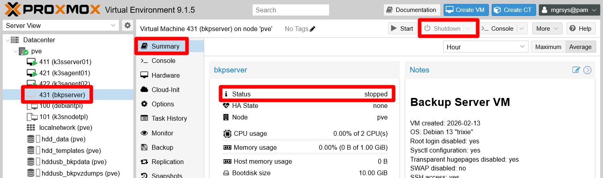
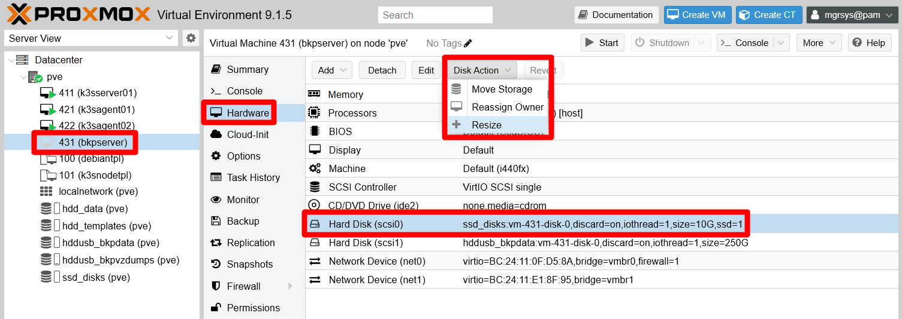
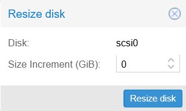
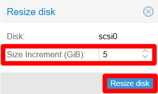
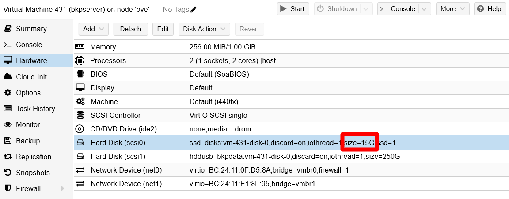
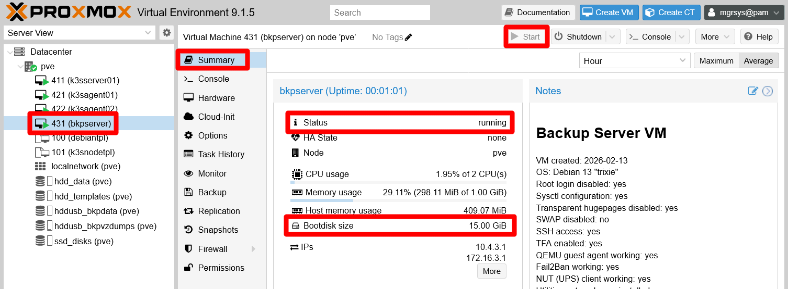

# G905 - Appendix 05 ~ Resizing a root LVM volume

- [Resize a VM's root LVM volume if you find it too small](#resize-a-vms-root-lvm-volume-if-you-find-it-too-small)
- [Resizing the storage drive on Proxmox VE](#resizing-the-storage-drive-on-proxmox-ve)
- [Extending the root LVM filesystem on a live VM](#extending-the-root-lvm-filesystem-on-a-live-vm)
  - [Resizing the related partitions](#resizing-the-related-partitions)
  - [Extending the `root` LVM volume](#extending-the-root-lvm-volume)
- [Final note](#final-note)
- [References](#references)
  - [About resizing LVM storage](#about-resizing-lvm-storage)
- [Navigation](#navigation)

## Resize a VM's root LVM volume if you find it too small

All of the VMs created in this guide are based in a VM template that has a 10 GiB bootdisk. What if you need a VM that needs more space for its root filesystem?

You can resize a VM's bootdisk through the Proxmox VE web console, then extend the root LVM filesystem inside of it over the new space. The procedure is not hard but, since it manipulates the `root` LVM filesystem while it is active, you must be careful when going through it.

As an example, this appendix will show you how to give 5 GiB more to the root filesystem of the UrBackup server created [in the chapter **G040**](G040%20-%20Backups%2004%20~%20UrBackup%2001%20-%20Server%20setup.md).

> [!IMPORTANT]
> **Do a backup of the VM where you will resize the root filesystem**\
> The procedure explained here has a non-trivial amount of danger for the root filesystem involved.
>
> Play it safe and make a backup of the VM before you start resizing its bootdisk.

## Resizing the storage drive on Proxmox VE

You can expand any hard disk attached to a VM easily on Proxmox VE:

1. Get into your Proxmox VE server's web console and select the VM, then shut it down:

    

    In this example, the VM to stop is `bkpserver`. Ensure it is stopped by checking both its activity icon on the sidetree and in its `Summary` view as highlighted above.

2. With the VM stopped, get into its `Hardware` tab, select the hard disk containing the VM's root filesystem (this is the _bootdisk_ for Proxmox VE) and then press on `Resize disk`:

    

    The hard disk containing the root filesystem of the `bkpserver` VM is the one identified as the `scsi0` unit for Proxmox VE and has 10 GiB of capacity.

3. After clicking on the `Resize` option of the `Disk Action` menu, the next form will appear:

    

    The `Disk` field identifies the hard disk you are about to resize which, in this case, is the `bkpserver`'s `scsi0` unit. The `Size Increment (GiB)` field is where you indicate by how many gibibytes you want to increase the size of this particular hard disk.

    > [!IMPORTANT]
    > Proxmox VE's web console only supports INCREASING hard disks sizes, not reducing them.

4. Type the size increment, in gibibytes, to apply to the hard disk and click on `Resize Disk`:

    

    In this example, the `bkpserver`'s `scsi0` unit will be made 5 GiB bigger.

5. Proxmox VE will apply the resize almost immediately after showing you a quick progress window that will close itself. Then, you will be able to see the new size shown in the hard disk description:

    

    The `bkpserver`'s `scsi0` hard disk unit now has a total of 15 GiB, from an initial capacity of 10 GiB.

## Extending the root LVM filesystem on a live VM

The hard disk is bigger now, but the VM's root filesystem is not using that extra space yet. You need to extend it over the newly available storage. Continuing with the example, here you will see how to extend the root filesystem of the `bkpserver` VM while it is running. Therefore, start the VM and proceed with the remainder of this procedure:

By the way, notice in the `Summary` view of the VM how the `Bootdisk` size also reflects the new size of the hard disk `scsi0`.

> [!WARNING]
> **Applying this procedure is dangerous!**\
> The following procedure could make your VM's filesystem (and the VM itself) unusable if you are not careful!
>
> If you have not done a backup of the VM yet, this is the moment to do so.

### Resizing the related partitions

Before you can extend the `root` LVM volume, you need to resize the partition in which it's found:

1. Open a remote shell into the VM with `mgrsys` user, then check with `fdisk` if the system truly sees the full size of the disk:

    ~~~sh
    $ sudo fdisk -l
    Disk /dev/sda: 15 GiB, 16106127360 bytes, 31457280 sectors
    Disk model: QEMU HARDDISK
    Units: sectors of 1 * 512 = 512 bytes
    Sector size (logical/physical): 512 bytes / 512 bytes
    I/O size (minimum/optimal): 512 bytes / 512 bytes
    Disklabel type: dos
    Disk identifier: 0x5dc9a39f

    Device     Boot   Start      End  Sectors  Size Id Type
    /dev/sda1  *       2048  1556479  1554432  759M 83 Linux
    /dev/sda2       1558526 20969471 19410946  9.3G  f W95 Ext'd (LBA)
    /dev/sda5       1558528 20969471 19410944  9.3G 8e Linux LVM

    Disk /dev/sdb: 250 GiB, 268435456000 bytes, 524288000 sectors
    Disk model: QEMU HARDDISK
    Units: sectors of 1 * 512 = 512 bytes
    Sector size (logical/physical): 512 bytes / 512 bytes
    I/O size (minimum/optimal): 512 bytes / 512 bytes

    Disk /dev/mapper/bkpserver--vg-root: 8.69 GiB, 9328132096 bytes, 18219008 sectors
    Units: sectors of 1 * 512 = 512 bytes
    Sector size (logical/physical): 512 bytes / 512 bytes
    I/O size (minimum/optimal): 512 bytes / 512 bytes

    Disk /dev/mapper/bkpserver--vg-swap_1: 544 MiB, 570425344 bytes, 1114112 sectors
    Units: sectors of 1 * 512 = 512 bytes
    Sector size (logical/physical): 512 bytes / 512 bytes
    I/O size (minimum/optimal): 512 bytes / 512 bytes
    ~~~

    Notice the `Disk /dev/sda` line, it says that the `sda` hard disk has the expected 15 GiB. Also see how inside `sda` there are three partitions: `sda1`, `sda2` and `sda5`. The `sda5` partition is the one you want to spread over the extra storage space available, since it is the one that contains the `root` LVM volume (and also the swap volume). But this `sda5` partition is inside the `W95 Ext'd (LBA)` `sda2` one, so you need to expand first the `sda2` partition to the end of the `sda` drive.

2. Now you're going to install another partition tool that will help you resize the `sda2` and `sda5` partitions easily. The tool is `parted`:

    ~~~sh
    $ sudo apt install -y parted
    ~~~

3. Launch `parted` over the `/dev/sda` drive:

    ~~~sh
    $ sudo parted /dev/sda
    ~~~

    You will get in the `parted` shell:

    ~~~sh
    GNU Parted 3.6
    Using /dev/sda
    Welcome to GNU Parted! Type 'help' to view a list of commands.
    (parted)
    ~~~

4. Execute `print` to check how `parted` sees the `sda` partitions:

    ~~~sh
    (parted) print
    Model: QEMU QEMU HARDDISK (scsi)
    Disk /dev/sda: 16.1GB
    Sector size (logical/physical): 512B/512B
    Partition Table: msdos
    Disk Flags:

    Number  Start   End     Size    Type      File system  Flags
    1      1049kB  797MB   796MB   primary   ext4         boot
    2      798MB   10.7GB  9938MB  extended               lba
    5      798MB   10.7GB  9938MB  logical                lvm
    ~~~

    Notice that the `Number` is what identifies each partition: the `sda2` is shown just as number `2`, and `sda5` as `5`.

5. Resize the partition `2` with the following `resize` command:

    > [!WARNING]
    > **Using `parted` on a live root filesystem is dangerous!**\
    > The `parted` program applies the changes in the partition table immediately, unlike `fdisk` that works first on a temporal table on memory.

    ~~~sh
    (parted) resizepart 2 -1s
    ~~~

    It will not return any output. Check with `print` that parted has resized the partition `2`:

    ~~~sh
    (parted) print
    Model: QEMU QEMU HARDDISK (scsi)
    Model: QEMU QEMU HARDDISK (scsi)
    Disk /dev/sda: 16.1GB
    Sector size (logical/physical): 512B/512B
    Partition Table: msdos
    Disk Flags:

    Number  Start   End     Size    Type      File system  Flags
    1      1049kB  797MB   796MB   primary   ext4         boot
    2      798MB   16.1GB  15.3GB  extended               lba
    5      798MB   10.7GB  9938MB  logical                lvm
    ~~~

6. Now, apply the resizing to partition `5`:

    ~~~sh
    (parted) resizepart 5 -1s
    ~~~

    Again, use `print` to verify the resizing of the partition `5`:

    ~~~sh
    (parted) print
    Model: QEMU QEMU HARDDISK (scsi)
    Disk /dev/sda: 16.1GB
    Sector size (logical/physical): 512B/512B
    Partition Table: msdos
    Disk Flags:

    Number  Start   End     Size    Type      File system  Flags
    1      1049kB  797MB   796MB   primary   ext4         boot
    2      798MB   16.1GB  15.3GB  extended               lba
    5      798MB   16.1GB  15.3GB  logical                lvm
    ~~~

7. Type `quit` or just use Ctrl+C to exit `parted`:

    ~~~sh
    (parted) quit
    Information: You may need to update /etc/fstab.
    ~~~

    Notice that, when exiting, `parted` will warn you about updating the `/etc/fstab` file. In this case it will not be necessary.

### Extending the `root` LVM volume

With the real partitions updated, now you can extend the root LVM filesystem in the newly available space:

1. First you must extend the physical volume that corresponds to the `sda5` partition. Check with `pvs` its current state:

    ~~~sh
    $ sudo pvs
      PV         VG           Fmt  Attr PSize PFree
      /dev/sda5  bkpserver-vg lvm2 a--  9.25g 36.00m
    ~~~

    Notice that its `PSize` is 9.25 GiB.

2. Use `pvresize` to expand the `sda5` PV:

    ~~~sh
    $ sudo pvresize /dev/sda5
      Physical volume "/dev/sda5" changed
      1 physical volume(s) resized or updated / 0 physical volume(s) not resized
    ~~~

    Then verify with `pvs` that the resizing has been done:

    ~~~sh
    $ sudo pvs
      PV         VG           Fmt  Attr PSize  PFree
      /dev/sda5  bkpserver-vg lvm2 a--  14.25g <5.04g
    ~~~

    Above you can see that `PSize` is now 14.25 GiB, from which 5.04 GiB are free (`PFree` column).

3. Now you can resize the `root` LV itself. First, check it's current status:

    ~~~sh
    $ sudo lvs
      LV     VG           Attr       LSize   Pool Origin Data%  Meta%  Move Log Cpy%Sync Convert
      root   bkpserver-vg -wi-ao----  <8.69g
      swap_1 bkpserver-vg -wi-ao---- 544.00m
    ~~~

    It's `LSize` is 8.69 GiB and, below it, you can see the swap volume (`swap_1`) taking up about 544 MiB.

4. Use the following `lvextend` command to extend the `root` volume over all the available free space in the `sda5` PV:

    ~~~sh
    $ sudo lvextend -r -l +100%FREE bkpserver-vg/root
      File system ext4 found on bkpserver-vg/root mounted at /.
      Size of logical volume bkpserver-vg/root changed from <8.69 GiB (2224 extents) to 13.72 GiB (3513 extents).
      Extending file system ext4 to 13.72 GiB (14734589952 bytes) on bkpserver-vg/root...
    resize2fs /dev/bkpserver-vg/root
    resize2fs 1.47.2 (1-Jan-2025)
    Filesystem at /dev/bkpserver-vg/root is mounted on /; on-line resizing required
    old_desc_blocks = 2, new_desc_blocks = 2
    The filesystem on /dev/bkpserver-vg/root is now 3597312 (4k) blocks long.

    resize2fs done
      Extended file system ext4 on bkpserver-vg/root.
      Logical volume bkpserver-vg/root successfully resized.
    ~~~

    The command not only has resized the LV, but also has resized the `ext4` filesystem inside (the `-r` option called the `resize2fs` command). Check again with `lvs` the new status of the `root` LV:

    ~~~sh
    $ sudo lvs
      LV     VG           Attr       LSize   Pool Origin Data%  Meta%  Move Log Cpy%Sync Convert
      root   bkpserver-vg -wi-ao----  13.72g
      swap_1 bkpserver-vg -wi-ao---- 544.00m
    ~~~

    Now it's `LSize` is 13.72 GiB, and the swap volume has been unaffected by the whole procedure.

5. As a final test, reboot the VM to verify that the changes have not messed up with the system in a bad way. This is something you may detect in the VM's boot sequence, although you can see a VM's boot sequence only through a noVNC shell, never through an ssh connection:

    ~~~sh
    $ sudo reboot
    ~~~

## Final note

You can apply this procedure to extend any non-root LVM filesystems kept in a Proxmox VE hard disk.

## References

### About resizing LVM storage

- [RootUsers. How to Increase the size of a Linux LVM by expanding the virtual machine disk](https://www.rootusers.com/how-to-increase-the-size-of-a-linux-lvm-by-expanding-the-virtual-machine-disk/)
- [RootUsers. LVM Resize – How to Increase an LVM Partition](https://www.rootusers.com/lvm-resize-how-to-increase-an-lvm-partition/)
- [VBonhomme. Extend a LVM partition after increasing its virtual disk on VirtualBox](https://blog.vbonhomme.fr/extend-a-lvm-partition-after-increasing-its-virtual-disk-on-virtualbox/)
- [Theducks.org. Expanding LVM Partitions in VMware, on the fly](https://theducks.org/2009/11/expanding-lvm-partitions-in-vmware-on-the-fly/)
- [StackExchange. Unix & Linux. How to resize LVM disk in Debian 8.6 without losing data](https://unix.stackexchange.com/questions/336979/how-to-resize-lvm-disk-in-debian-8-6-without-losing-data)
- [StackExchange. Unix & Linux. How do I extend a partition with a LVM and the contained physical volume and logical volume?](https://unix.stackexchange.com/questions/98339/how-do-i-extend-a-partition-with-a-lvm-and-the-contained-physical-volume-and-log)
- [ServerFault. How to extend a Linux PV partition online after virtual disk growth](https://serverfault.com/questions/378086/how-to-extend-a-linux-pv-partition-online-after-virtual-disk-growth)

## Navigation

[<< Previous (**G904. Appendix 04**)](G904%20-%20Appendix%2004%20~%20Handling%20VM%20or%20VM%20template%20volumes.md) | [+Table Of Contents+](G000%20-%20Table%20Of%20Contents.md) | [Next (**G906. Appendix 06**) >>](G906%20-%20Appendix%2006%20~%20K3s%20cluster%20with%20two%20or%20more%20server%20nodes.md)
