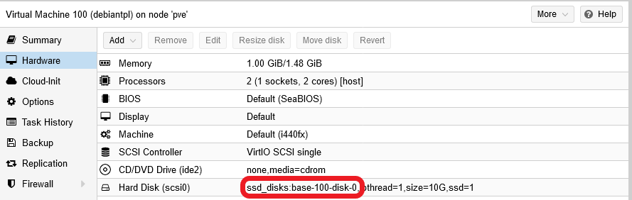
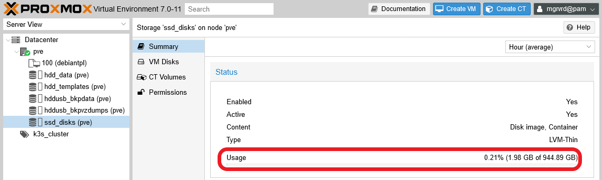

# G906 - Appendix 06 ~ Handling VM or VM template volumes

The hard disks attached to a VM or a VM template are, in fact, VM disk images. In the case of the Debian VM created in the [**G020** guide](G020%20-%20K3s%20cluster%20setup%2003%20~%20Debian%20VM%20creation.md#building-a-debian-virtual-machine), its hard disk is an image that has been created as a LVM light volume within a thinpool. This way, the disk image is not just a file, but a virtual storage device that contains the VM's entire filesystem. How to locate and, when necessary, handle such an image? Read the following subsections to have a glimpse about this.

## Installing the `libguestfs-tools` package

The Proxmox VE web console only gives you a very limited range of actions, like creation or size enlargement, to perform over any VM's hard disks. Also, there's in your system the `qemu-img` command to manipulate these images, but it's also kind of limited. A much more powerful command toolkit for handling VM disk images is the one provided by the `libguestfs-tools` package.

1. You don't have it installed in your Proxmox VE host, so open a shell in it and install the package with `apt`.

    ~~~bash
    $ sudo apt install -y libguestfs-tools
    ~~~

    This package's installation will execute a considerable number of actions and install several dependencies, so you'll see a lot of output lines on this process.

2. Since this installation has done quite a bunch of things in your Proxmox VE host, its better if you reboot it right after installing the `libguestfs-tools` package.

    ~~~bash
    $ sudo reboot
    ~~~

The `libguestfs-tools` package comes with a big set of commands that allows you to handle in complex ways VM disk images. Check them out in the documentation available at [libguestfs' official page](https://libguestfs.org/).

## Locating and checking a VM or VM template's hard disk volume

So, where in your system is the VM disk image of your VM template?

1. In the Proxmox VE web console, go to your VM template's `Hardware` view, and read the `Hard Disk` line.

    

    Remember the `ssd_disks:base-100-disk-0` string: it's the name of the hard disk volume within your Proxmox VE node.

2. Next, open a shell terminal (as your administrator user) on your Proxmox VE host and execute the following `lvs` command.

    ~~~bash
    $ sudo lvs -o lv_full_name,pool_lv,lv_attr,lv_size,lv_path,lv_dm_path
      LV                       Pool      Attr       LSize   Path                          DMPath
      hddint/hdd_data                    twi-a-tz-- 870.00g                               /dev/mapper/hddint-hdd_data
      hddint/hdd_templates               -wi-ao----  60.00g /dev/hddint/hdd_templates     /dev/mapper/hddint-hdd_templates
      hddusb/hddusb_bkpdata              twi-a-tz--  <1.31t                               /dev/mapper/hddusb-hddusb_bkpdata
      hddusb/hddusb_bkpvzdumps           -wi-ao---- 520.00g /dev/hddusb/hddusb_bkpvzdumps /dev/mapper/hddusb-hddusb_bkpvzdumps
      pve/root                           -wi-ao---- <37.50g /dev/pve/root                 /dev/mapper/pve-root
      pve/swap                           -wi-ao----  12.00g /dev/pve/swap                 /dev/mapper/pve-swap
      ssdint/base-100-disk-0   ssd_disks Vri---tz-k  10.00g /dev/ssdint/base-100-disk-0   /dev/mapper/ssdint-base--100--disk--0
      ssdint/ssd_disks                   twi-aotz-- 880.00g                               /dev/mapper/ssdint-ssd_disks
    ~~~

    In the `lvs` output above, you can see your VM template's hard disk volume named as `ssdint/base-100-disk-0`. This means that it's a volume within the `ssdint` LVM volume group you created back in the G005 guide. Not only that, in the `Pool` column you see the name `ssd_disks`, which refers to the LVM thinpool you created in the [**G019** guide](G019%20-%20K3s%20cluster%20setup%2002%20~%20Storage%20setup.md). The next `Attr` column gives you some information about the volume itself:

    - `V` indicates that the volume is _virtual_.
    - `r` means that this volume is _read-only_.
    - `i` refers to the storage allocation policy used in this volume, in this case is _inherited_.
    - `t` means that this volume uses the thin provisioning driver as _kernel target_.
    - `z` indicates that newly-allocated data blocks are overwritten with blocks of (z)eroes before use.
    - `k` is a flag to make the system skip this volume during activation.

    > **NOTE**  
    > To know all the possible values in the `Attr` column, check the **Notes** section of the `lvs` manual (command `man lvs`).

    Next to the `Attr` column, you can see the size assigned to the volume, 10 GiB in this case, although this number is just logical. If you return to the Proxmox VE web console, and then go to the `ssd_disks` thinpool `Summary` view, you'll see in `Usage` that much less than 10 GiB are actually in use.

    

    In this case, just 1.98 GiB are actually in use in the thinpool and, at this point, only the `base-100-disk-0` volume is present there.

    And what about the columns `Path` and the `DMPath` of the `lvs` output? They're the paths to the handler files used by the system to manage the light volumes. You can see them with the `ls` command, except the ones used for the `base-100-disk-0` volume. Since this volume is not active (remember the `k` flag in the `Attr` column), you won't find the corresponding files present in the system.

    In conclusion, with the storage structure you have setup in your system, mostly based on LVM thinpools, all your hard disk volumes will be **virtual** volumes within LVM **thinpools**. In the case of your VM template's sole hard disk, the concrete LVM location is as follows:

    - Volume Group `ssdint`.
    - Thinpool `ssd_disks`.
    - Light Volume `base-100-disk-0`.

    Remember that, in this scenario, the `ssdint` VG corresponds to an entire physical LVM volume set within the `/dev/sda4` PV which, moreover, shares the real underlying ssd unit with the `/dev/sda3` PV (the one containing the `pve` volume group for the Proxmox VE system volumes).

You've seen the LVM side of the story, but you can get more information about the VM disk image by using some **libguestfs** commands. In fact, you can even get inside the filesystem within the disk image. To do so, first you have to activate the disk image as light volume, since when you turned the VM into a template, it's hard disk is now disabled and read-only for LVM to avoid further modifications.

1. Reactivate the volume with the following `lvchange` command.

    ~~~bash
    sudo lvchange -ay -K ssdint/base-100-disk-0
    ~~~

    Since the previous command doesn't give back any output in success, use the lvs command to verify it's status.

    ~~~bash
    $ sudo lvs ssdint/base-100-disk-0
      LV              VG     Attr       LSize  Pool      Origin Data%  Meta%  Move Log Cpy%Sync Convert
      base-100-disk-0 ssdint Vri-a-tz-k 10.00g ssd_disks        18.56
    ~~~

    Notice the `a` among the values under the `Attr` column, that means the volume is now active. Other command to check out what light volumes are active is `lvscan`.

    ~~~bash
    $ sudo lvscan
      ACTIVE            '/dev/hddusb/hddusb_bkpvzdumps' [520.00 GiB] inherit
      ACTIVE            '/dev/hddusb/hddusb_bkpdata' [<1.31 TiB] inherit
      ACTIVE            '/dev/hddint/hdd_templates' [60.00 GiB] inherit
      ACTIVE            '/dev/hddint/hdd_data' [870.00 GiB] inherit
      ACTIVE            '/dev/ssdint/ssd_disks' [880.00 GiB] inherit
      ACTIVE            '/dev/ssdint/base-100-disk-0' [10.00 GiB] inherit
      ACTIVE            '/dev/pve/swap' [12.00 GiB] inherit
      ACTIVE            '/dev/pve/root' [<37.50 GiB] inherit
    ~~~

    This command shows you the state of all the present light volumes, active or inactive. Also notice that it shows the full handler path to the volumes.

2. With the `base-100-disk-0` volume now active, you can check out the status of the filesystem it contains with the **libguestfs** command `virt-df`.

    ~~~bash
    $ sudo virt-df -h -a /dev/ssdint/base-100-disk-0
    Filesystem                                Size       Used  Available  Use%
    base-100-disk-0:/dev/sda1                 469M        47M       398M   11%
    base-100-disk-0:/dev/debiantpl-vg/root
                                              8.3G       1.1G       6.8G   14%
    ~~~

    This `virt-df` command is very similar to the `df`, and gives you a view of how the storage space is used in the filesystem contained in the volume. Remember that this is the filesystem of your Debian VM template, and it also has a swap volume although the `virt-df` command doesn't show it.

3. Another command you might like to try and get a much more complete picture of the filesystem within the `base-100-disk-0` volume is `virt-filesystems`.

    ~~~bash
    $ sudo virt-filesystems -a /dev/ssdint/base-100-disk-0 --all --long --uuid -h
    Name                     Type       VFS  Label MBR Size Parent            UUID
    /dev/sda1                filesystem ext2 -     -   469M -                 ec1735f0-edf0-41c5-b54f-9012092a7a2c
    /dev/debiantpl-vg/root   filesystem ext4 -     -   8.3G -                 41032d28-f6d8-416b-936b-bb0fd803e832
    /dev/debiantpl-vg/swap_1 filesystem swap -     -   976M -                 71cb513a-ef5f-480c-ad54-dea7734d9a97
    /dev/debiantpl-vg/root   lv         -    -     -   8.5G /dev/debiantpl-vg 0NOJ1z-HMPD-nHl6-OdQr-rgpR-nxtf-FI0i44
    /dev/debiantpl-vg/swap_1 lv         -    -     -   976M /dev/debiantpl-vg Kci3BQ-ITxT-SNuC-ITux-BI1x-Wtr2-t9c2RG
    /dev/debiantpl-vg        vg         -    -     -   9.5G /dev/sda5         8cH6WfvK16w50hvYRVx1PyuB2gQrxLgW
    /dev/sda5                pv         -    -     -   9.5G -                 Cx7CAvy5XaYDMWtdVERRC4f7aTfG2jDQ
    /dev/sda1                partition  -    -     83  487M /dev/sda          -
    /dev/sda2                partition  -    -     05  1.0K /dev/sda          -
    /dev/sda5                partition  -    -     8e  9.5G /dev/sda          -
    /dev/sda                 device     -    -     -   10G  -                 -
    ~~~

    See how not only this command returns info about the two LVM light volumes (root and swap_1), but also shows the `sda` partitions and the LVM physical volume `sda5`.

4. After you've finished checking the `base-100-disk-0` volume, it's better if you deactivate it. For this, use `lvchange` again.

    ~~~bash
    $ sudo lvchange -an ssdint/base-100-disk-0
    ~~~

    Verify its inactive status directly with the `lvscan` command.

    ~~~bash
    $ sudo lvscan
      ACTIVE            '/dev/hddusb/hddusb_bkpvzdumps' [520.00 GiB] inherit
      ACTIVE            '/dev/hddusb/hddusb_bkpdata' [<1.31 TiB] inherit
      ACTIVE            '/dev/hddint/hdd_templates' [60.00 GiB] inherit
      ACTIVE            '/dev/hddint/hdd_data' [870.00 GiB] inherit
      ACTIVE            '/dev/ssdint/ssd_disks' [880.00 GiB] inherit
      inactive          '/dev/ssdint/base-100-disk-0' [10.00 GiB] inherit
      ACTIVE            '/dev/pve/swap' [12.00 GiB] inherit
      ACTIVE            '/dev/pve/root' [<37.50 GiB] inherit
    ~~~

    Remember that when the volume is inactive, the handler file doesn't exist in the system. Also, know that there is a corresponding `/dev/mapper` handler file for each volume. For your `base-100-disk-0` volume, the full path would be `/dev/mapper/ssdint-base--100--disk--0`.

## Relevant system paths

### _Directories on Proxmox VE host_

- `/dev`
- `/dev/mapper`
- `/dev/ssdint`

### _Files on Proxmox VE host_

- `/dev/mapper/ssdint-base--100--disk--0`
- `/dev/ssdint/base-100-disk-0`

## References

### _Handling of VM disk images_

- [libguestfs official page](https://libguestfs.org/)
- [virt-resize –shrink now works](https://rwmj.wordpress.com/2010/09/27/virt-resize-shrink-now-works/)
- [shrink virtual disk size of VM](https://gist.github.com/smurugap/357e705944e14af0799884cb0effac6c)
- [Proxmox VE wiki. Resize disks](https://pve.proxmox.com/wiki/Resize_disks)
- [How to shrink KVM/qemu partition and image size](https://blog.mevijay.com/2019/11/how-to-shrink-kvmqemu-partition-and.html)
- [LVM Resize – How to Decrease an LVM Partition](https://www.rootusers.com/lvm-resize-how-to-decrease-an-lvm-partition/)
- [How to Manage and Use LVM (Logical Volume Management) in Ubuntu](https://www.howtogeek.com/howto/40702/how-to-manage-and-use-lvm-logical-volume-management-in-ubuntu/)
- [How to Extend/Increase LVM’s (Logical Volume Resize) in Linux](https://www.2daygeek.com/extend-increase-resize-lvm-logical-volume-in-linux/)
- [Red Hat Enterprise Linux 8. Configuring and managing logical volumes. Chapter 14. Logical volume activation](https://access.redhat.com/documentation/en-us/red_hat_enterprise_linux/8/html/configuring_and_managing_logical_volumes/assembly_lvm-activation-configuring-and-managing-logical-volumes)
- [Red Hat Enterprise Linux 8. Configuring and managing logical volumes. Chapter 4. Configuring LVM logical volumes](https://access.redhat.com/documentation/en-us/red_hat_enterprise_linux/8/html/configuring_and_managing_logical_volumes/assembly_configuring-lvm-volumes-configuring-and-managing-logical-volumes)
- [How to Extend/Reduce LVM’s (Logical Volume Management) in Linux – Part II](https://www.tecmint.com/extend-and-reduce-lvms-in-linux/)
- [Linux Man Pages - lvchange (8)](https://www.systutorials.com/docs/linux/man/8-lvchange/)

## Navigation

[<< Previous (**G905. Appendix 05**)](G905%20-%20Appendix%2005%20~%20Cloning%20storage%20drives%20with%20Clonezilla.md) | [+Table Of Contents+](G000%20-%20Table%20Of%20Contents.md) | [Next (**G907. Appendix 07**) >>](G907%20-%20Appendix%2007%20~%20Resizing%20a%20root%20LVM%20volume.md)
