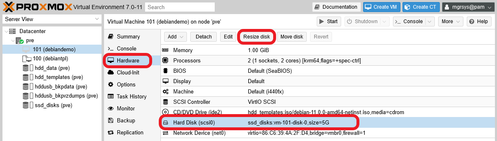
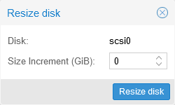
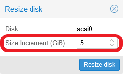
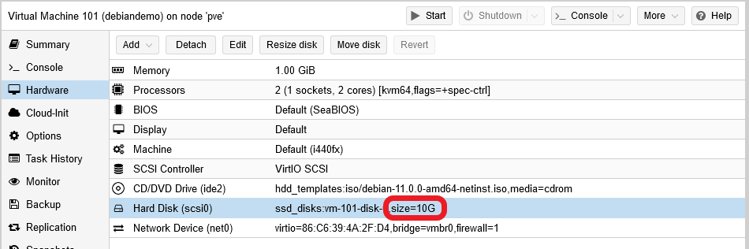

# G907 - Appendix 07 ~ Resizing a root LVM volume

Let's say you happen to have a Debian-based VM with a small single storage drive (_hard disk_ in Proxmox VE) of about 5 GiB, and you need to make it bigger, up to 10 GiB for instance. To do so you'll have to resize the hard disk first, then you'll need to extend the root LVM filesystem inside of it over the new space. The procedure is not hard but, since it manipulates the `root` filesystem while it's active, you must be careful when going through it.

## Resizing the storage drive on Proxmox VE

You can expand any hard disk attached to a VM easily on Proxmox VE.

1. With the VM **shutdown**, get into the `Hardware` tab, select the hard disk and then press on `Resize disk`.

    

    In this case, the hard disk to resize has a 5 GiB size.

2. You'll get to a very simple form.

    

    The `Disk` field identifies the hard disk you're about to resize, and the `Size Increment` field is where you indicate by how much you want to increase the size of this particular hard disk.

    > **BEWARE!**  
    > The Proxmox VE web console only supports INCREASING a hard disk's size, not reducing it.

3. Type the increment, in gigabytes, you want to apply to the hard disk and click on `Resize Disk`.

    

    In this case, the hard disk will be made 5 GiB bigger.

4. Proxmox VE will apply the resize immediately, so you'll see the new size shown in the hard disk description.

    

    The hard disk now has a total of 10 GiB, from an initial capacity of 5 GiB.

## Extending the root LVM filesystem on a live VM

The hard disk is bigger now, but the VM's filesystem is not using that extra space yet. You need to extend it over the newly available space. Assuming the VM is a Debian system installed over a LVM filesystem, here you'll see how to extend it's root filesytem while the VM is running.

> **BEWARE!**  
> The following procedure, if not applied with care, could make your VM's filesystem (and the VM itself) unusable!

### _Resizing the related partitions_

Before you can extend the `root` LVM volume, you need to resize the partition in which it's found.

1. Check with `fdisk` if your system truly sees the full size of the disk.

    ~~~bash
    $ sudo fdisk -l
    Disk /dev/sda: 10 GiB, 10737418240 bytes, 20971520 sectors
    Disk model: QEMU HARDDISK
    Units: sectors of 1 * 512 = 512 bytes
    Sector size (logical/physical): 512 bytes / 512 bytes
    I/O size (minimum/optimal): 512 bytes / 512 bytes
    Disklabel type: dos
    Disk identifier: 0xf8a21db5

    Device     Boot   Start      End Sectors  Size Id Type
    /dev/sda1  *       2048   999423  997376  487M 83 Linux
    /dev/sda2       1001470 10483711 9482242  4.5G  5 Extended
    /dev/sda5       1001472 10483711 9482240  4.5G 8e Linux LVM

    Disk /dev/mapper/debiandemo--vg-root: 3.56 GiB, 3825205248 bytes, 7471104 sectors
    Units: sectors of 1 * 512 = 512 bytes
    Sector size (logical/physical): 512 bytes / 512 bytes
    I/O size (minimum/optimal): 512 bytes / 512 bytes

    Disk /dev/mapper/debiandemo--vg-swap_1: 980 MiB, 1027604480 bytes, 2007040 sectors
    Units: sectors of 1 * 512 = 512 bytes
    Sector size (logical/physical): 512 bytes / 512 bytes
    I/O size (minimum/optimal): 512 bytes / 512 bytes
    ~~~

    Notice the `Disk /dev/sda` line, it says that the `sda` harddisk has the expected 10 GiB. Also see how inside `sda` there are three partitions: `sda1`, `sda2` and `sda5`. The `sda5` partition is the one you want to spread over the extra storage space available, since its the one that contains the `root` LVM volume (and also the swap volume). But this `sda5` partition is inside the `Extended` `sda2` one, so you need to expand first the `sda2` partition to the end of the `sda` drive.

2. Now you're going to install another partition tool that will help you resize the `sda2` and `sda5` partitions easily. The tool is `parted`.

    ~~~bash
    $ sudo apt install -y parted
    ~~~

3. Launch `parted` over the `/dev/sda` drive.

    ~~~bash
    $ sudo parted /dev/sda
    ~~~

    Then you'll get in the `parted` shell.

    ~~~bash
    GNU Parted 3.4
    Using /dev/sda
    Welcome to GNU Parted! Type 'help' to view a list of commands.
    (parted)
    ~~~

4. Execute `print` to check how `parted` sees the `sda` partitions.

    ~~~bash
    (parted) print
    Model: QEMU QEMU HARDDISK (scsi)
    Disk /dev/sda: 10.7GB
    Sector size (logical/physical): 512B/512B
    Partition Table: msdos
    Disk Flags:

    Number  Start   End     Size    Type      File system  Flags
     1      1049kB  512MB   511MB   primary   ext2         boot
     2      513MB   5368MB  4855MB  extended
     5      513MB   5368MB  4855MB  logical                lvm
    ~~~

    Notice that the `Number` is what identifies each partition: the `sda2` is shown just as number `2`, and `sda5` as `5`.

5. Resize the partition `2` with the following `resize` command.

    > **BEWARE!**  
    > The `parted` program applies the changes in the partition table immediately, unlike `fdisk` that works first on a temporal table on memory.

    ~~~bash
    (parted) resizepart 2 -1s
    ~~~

    It won't return any output. Check with `print` that the resizing has been done.

    ~~~bash
    (parted) print
    Model: QEMU QEMU HARDDISK (scsi)
    Disk /dev/sda: 10.7GB
    Sector size (logical/physical): 512B/512B
    Partition Table: msdos
    Disk Flags:

    Number  Start   End     Size    Type      File system  Flags
     1      1049kB  512MB   511MB   primary   ext2         boot
     2      513MB   10.7GB  10.2GB  extended
     5      513MB   5368MB  4855MB  logical                lvm
    ~~~

6. Now, apply the resizing to partition `5`.

    ~~~bash
    (parted) resizepart 5 -1s
    ~~~

    Again, use `print` to verify the resizing.

    ~~~bash
    (parted) print
    Model: QEMU QEMU HARDDISK (scsi)
    Disk /dev/sda: 10.7GB
    Sector size (logical/physical): 512B/512B
    Partition Table: msdos
    Disk Flags:

    Number  Start   End     Size    Type      File system  Flags
     1      1049kB  512MB   511MB   primary   ext2         boot
     2      513MB   10.7GB  10.2GB  extended
     5      513MB   10.7GB  10.2GB  logical                lvm
    ~~~

7. Type `quit` or just use Ctrl+C to exit `parted`.

    ~~~bash
    (parted) quit
    Information: You may need to update /etc/fstab.
    ~~~

    Notice that, when exiting, `parted` will warn you about updating the `/etc/fstab` file. In this case it won't be necessary.

### _Extending the `root` LVM volume_

With the real partitions updated, now you can extend the LVM filesystem in the newly available space.

1. First you must extend the physical volume that corresponds to the `sda5` partition. Check with `pvs` its current state.

    ~~~bash
    $ sudo pvs
      PV         VG            Fmt  Attr PSize  PFree
      /dev/sda5  debiandemo-vg lvm2 a--  <4.52g    0
    ~~~

    Notice that its `PSize` is only around 4.5 GiB.

2. Use `pvresize` to expand the `sda5` PV.

    ~~~bash
    $ sudo pvresize /dev/sda5
      Physical volume "/dev/sda5" changed
      1 physical volume(s) resized or updated / 0 physical volume(s) not resized
    ~~~

    Then verify with `pvs` that the resizing has been done.

    ~~~bash
    $ sudo pvs
      PV         VG            Fmt  Attr PSize  PFree
      /dev/sda5  debiandemo-vg lvm2 a--  <9.52g 5.00g
    ~~~

    Above you can see that `PSize` is now 9.52 GiB, from which 5 GiB are free (`PFree` column).

3. Now you can resize the `root` LV itself. First, check it's current status.

    ~~~bash
    $ sudo lvs
      LV     VG            Attr       LSize   Pool Origin Data%  Meta%  Move Log Cpy%Sync Convert
      root   debiandemo-vg -wi-ao----   3.56g
      swap_1 debiandemo-vg -wi-ao---- 980.00m
    ~~~

    It's `LSize` is 3.56 GiB and, below it, you can see the swap volume (`swap_1`) taking up a bit less than 1 GiB.

4. Use the following `lvextend` command to extend the `root` volume over all the **available** free space in the `sda5` PV.

    ~~~bash
    $ sudo lvextend -r -l +100%FREE debiandemo-vg/root
      Size of logical volume debiandemo-vg/root changed from 3.56 GiB (912 extents) to 8.56 GiB (2192 extents).
      Logical volume debiandemo-vg/root successfully resized.
    resize2fs 1.46.2 (28-Feb-2021)
    Filesystem at /dev/mapper/debiandemo--vg-root is mounted on /; on-line resizing required
    old_desc_blocks = 1, new_desc_blocks = 2
    The filesystem on /dev/mapper/debiandemo--vg-root is now 2244608 (4k) blocks long.
    ~~~

    The command not only has resized the LV, but also has resized the `ext4` filesystem inside (the `-r` option called the `resize2fs` command). Check again with `lvs` the new status of the `root` LV.

    ~~~bash
    $ sudo lvs
      LV     VG            Attr       LSize   Pool Origin Data%  Meta%  Move Log Cpy%Sync Convert
      root   debiandemo-vg -wi-ao----   8.56g
      swap_1 debiandemo-vg -wi-ao---- 980.00m
    ~~~

    Now it's `LSize` is 8.56 GiB, and the swap volume has been unaffected by the whole procedure.

5. As a final test, reboot the VM to verify that the changes have not messed up with the system in a bad way. This is something you may detect in the VM's boot sequence, sequence which you can see only through a noVNC shell, never remotely through ssh.

    ~~~bash
    $ sudo reboot
    ~~~

## Final note

This procedure is, as it is, also valid to extend any non-root LVM volumes.

## References

### _About resizing LVM storage_

- [How to resize LVM disk in Debian 8.6 without losing data](https://unix.stackexchange.com/questions/336979/how-to-resize-lvm-disk-in-debian-8-6-without-losing-data)
- [Expanding LVM Partitions in VMware, on the fly](https://theducks.org/2009/11/expanding-lvm-partitions-in-vmware-on-the-fly/)
- [How to extend a Linux PV partition online after virtual disk growth](https://serverfault.com/questions/378086/how-to-extend-a-linux-pv-partition-online-after-virtual-disk-growth)
- [Extend a LVM partition after increasing its virtual disk on Virtualbox](https://blog.vbonhomme.fr/extend-a-lvm-partition-after-increasing-its-virtual-disk-on-virtualbox/)
- [How do I extend a partition with a LVM and the contained physical volume and logical volume?](https://unix.stackexchange.com/questions/98339/how-do-i-extend-a-partition-with-a-lvm-and-the-contained-physical-volume-and-log)
- [CentOS / RHEL : How to extend Physical Volume in LVM by extending the Disk Partition used](https://www.thegeekdiary.com/centos-rhel-how-to-extend-physical-volume-in-lvm-by-extending-the-disk-partition-used/)
- [How to Increase the size of a Linux LVM by expanding the virtual machine disk](https://www.rootusers.com/how-to-increase-the-size-of-a-linux-lvm-by-expanding-the-virtual-machine-disk/)
- [LVM Resize – How to Increase an LVM Partition](https://www.rootusers.com/lvm-resize-how-to-increase-an-lvm-partition/)
