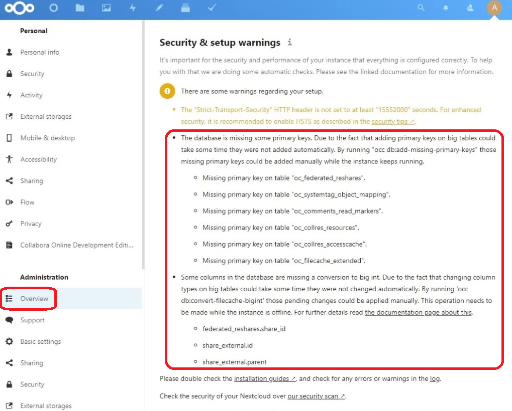
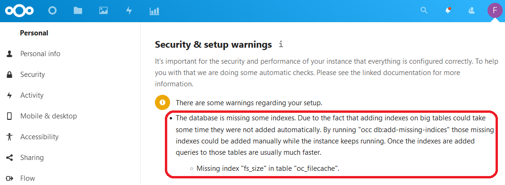

# G914 - Appendix 14 ~ Post-update manual maintenance tasks for Nextcloud

When you update your Nextcloud instance to a new minor or major version, the update can also come with changes that affect Nextcloud's database structure. Nextcloud will warn you of this in the `Administration settings > Overview` page.

For instance, you could be warned of missing primary keys or columns in the database, as [Basil Hendroff](https://github.com/basilhendroff) illustrates in his [Tech Diary's post](https://blog.udance.com.au/2021/02/25/nextcloud-using-occ-in-a-freenas-jail/) with the next snapshot (red highlighting mine over his screenshot).

Or it could just warn you about missing indexes, as shown in the following capture taken from this [How2itsec post](https://how2itsec.blogspot.com/2021/12/nextcloud-repairing-missing-indexes-in.html) (again, red highlighting is mine).

The common factor in both examples is that all those warnings indicate how you can solve them by executing a certain Nextcloud's `occ` command, together with some specific option for each case. But running shell commands in Kubernetes setups is not a straightforward affair.

## Concerns

The main concern here is that you need to execute that `occ` command but you can't do it in any way from Nextcloud's web interface. You must get into the container running your Nextcloud instance and execute the command from there. I already explained how to get shell access into containers in the [Shell access into your containers](G036%20-%20Host%20and%20K3s%20cluster%20~%20Monitoring%20and%20diagnosis.md#shell-access-into-your-containers) section of the [G036 guide](G036%20-%20Host%20and%20K3s%20cluster%20~%20Monitoring%20and%20diagnosis.md).

With the shell access to the container covered, there are a few extra concerns to consider before trying to execute the `occ` command.

- The `occ` command **must be executed with the same user** under which Nextcloud is running. This user will be different depending on which Nextcloud's image you're running in your setup, for an apache setup on a Debian-based image it'll be the `www-data` one.
    - The problem here is that you won't have the `sudo` command available in the container. Also, other equivalent commands either won't be present too or, if they are, may not work. The only one that I've found out able to run `occ` properly is [`runuser`](https://man7.org/linux/man-pages/man1/runuser.1.html).
- For safety reasons, you don't want to run updates on your software's database while the software itself is running and accessing its own database. In this case, Nextcloud is perfectly fine if you execute `occ` commands with it still running.
    - Still, you should do this only when **no user** is using your Nextcloud instance, just to be sure to avoid any corruptions or similar issues happening on the database.
- In general, **Nextcloud doesn't support downgrades**. But, if you find yourself in a situation that it has to be done somehow, remember that, if you've already applied the `occ` fixes to the database after an update, that database may not work well (if at all) with previous versions of Nextcloud.

## Procedure

Next, I'll show you the procedure to execute the `occ` command in the container running the Apache version of the Nextcloud's Debian-based image used in the configuration explained by [G033's part 4 guide](G033%20-%20Deploying%20services%2002%20~%20Nextcloud%20-%20Part%204%20-%20Nextcloud%20server.md).

1. From your `kubectl` client system, check which pod is the one currently running your Nextcloud apache server container.

    ~~~bash
    $ kubectl get pod -n nextcloud
    NAME                                READY   STATUS    RESTARTS   AGE
    nxcd-db-mariadb-0                   1/1     Running   0          3h5m
    nxcd-cache-redis-7477c5b8b4-vpg29   1/1     Running   0          3h5m
    nxcd-server-apache-nextcloud-0      1/1     Running   0          3h5m
    ~~~

    In this case, the pod is the one named `nxcd-server-apache-nextcloud-0`.

2. The container itself is called `server`, so you only have to use the right `kubectl` command to open a shell on it.

    ~~~bash
    $ kubectl exec -it -n nextcloud nxcd-server-apache-nextcloud-0 -c server -- bash
    ~~~

    Notice that I'm invoking the **bash** shell in the `kubectl` call, and you should get the following prompt as a result.

    ~~~bash
    root@nxcd-server-apache-nextcloud-0:/var/www/html#
    ~~~

    Notice how the prompt indicates that you are `root` in this remote session, and placed directly in the `/var/www/html` folder. I'll reduce the prompt just to the '`#`' character in the upcoming shell code samples.
    
    > **BEWARE!**  
    > You're the superuser, but you **cannot execute** the `occ` command with it. If you tried, `occ` would complain about you not having the right user to execute it. Hence the need of using the `runuser` command to invoke `occ`.

3. Locate the `occ` command. In the Apache version of the Nextcloud image is in `/var/www/html`, right where you got placed when you remotely accessed the container. You can verify this by executing an `ls` there.

    ~~~bash
    # ls -al
    total 184
    drwxr-xr-x 15 www-data www-data  4096 Mar 16 15:21 .
    drwxrwxr-x  1 www-data root      4096 Mar  2 01:25 ..
    -rw-r--r--  1 www-data www-data  4385 Mar 16 15:20 .htaccess
    -rw-r--r--  1 www-data www-data   101 Mar 16 15:20 .user.ini
    drwxr-xr-x 47 www-data www-data  4096 Mar 16 15:20 3rdparty
    -rw-r--r--  1 www-data www-data 19327 Mar 16 15:20 AUTHORS
    -rw-r--r--  1 www-data www-data 34520 Mar 16 15:20 COPYING
    drwxr-xr-x 50 www-data www-data  4096 Mar 16 15:20 apps
    drwxr-xr-x  2 www-data root      4096 Sep  6  2022 config
    -rw-r--r--  1 www-data www-data  4095 Mar 16 15:20 console.php
    drwxr-xr-x 23 www-data www-data  4096 Mar 16 15:20 core
    -rw-r--r--  1 www-data www-data  6317 Mar 16 15:20 cron.php
    drwxr-xr-x  8 www-data root      4096 Apr  2 11:05 custom_apps
    drwxrwx---  7 www-data www-data  4096 Aug  5  2022 data
    drwxr-xr-x  2 www-data www-data 12288 Mar 16 15:20 dist
    -rw-r--r--  1 www-data www-data   156 Mar 16 15:20 index.html
    -rw-r--r--  1 www-data www-data  3456 Mar 16 15:20 index.php
    drwxr-xr-x  6 www-data www-data  4096 Mar 16 15:20 lib
    -rwxr-xr-x  1 www-data www-data   283 Mar 16 15:20 occ
    drwxr-xr-x  2 www-data www-data  4096 Mar 16 15:20 ocm-provider
    drwxr-xr-x  2 www-data www-data  4096 Mar 16 15:20 ocs
    drwxr-xr-x  2 www-data www-data  4096 Mar 16 15:20 ocs-provider
    -rw-r--r--  1 www-data www-data  3139 Mar 16 15:20 public.php
    -rw-r--r--  1 www-data www-data  5549 Mar 16 15:20 remote.php
    drwxr-xr-x  4 www-data www-data  4096 Mar 16 15:20 resources
    -rw-r--r--  1 www-data www-data    26 Mar 16 15:20 robots.txt
    -rw-r--r--  1 www-data www-data  2452 Mar 16 15:20 status.php
    drwxr-xr-x  3 www-data root      4096 Aug  5  2022 themes
    -rw-r--r--  1 www-data www-data   383 Mar 16 15:20 version.php
    ~~~

    This folder is where all the Nextcloud binaries are found, including the `occ` command. See how the owner of all files and folders is `www-data`, the user running the Apache service that's serving your Nextcloud instance.

4. Execute `occ` with the `runuser` command. Remember that you'll have to run it once per each different issue reported by Nextcloud. Let's say that you only have to fix the missing indexes problem. You would run `occ` with the `db:add-missing-indices` option as follows.

    ~~~bash
    # runuser -u www-data -- /var/www/html/occ db:add-missing-indices
    ~~~

    In this case, you only need to specify two things to `runuser`.

    - `-u www-data`: the user that'll run the command launched by `runuser`.
    - `-- /var/www/html/occ db:add-missing-indices`: the command that `runuser` has to execute. Notice that I've used the **absolute path** to the `occ` command.

    This command will give you an output like this.

    ~~~bash
    Check indices of the share table.
    Check indices of the filecache table.
    Adding additional size index to the filecache table, this can take some time...
    Filecache table updated successfully.
    Check indices of the twofactor_providers table.
    Check indices of the login_flow_v2 table.
    Check indices of the whats_new table.
    Check indices of the cards table.
    Check indices of the cards_properties table.
    Check indices of the calendarobjects_props table.
    Check indices of the schedulingobjects table.
    Check indices of the oc_properties table.
    ~~~

5. After the `occ` command finishes, you can go back to your Nextcloud web console and refresh the `Administration settings > Overview` blade to check if the related warning has disappeared.

6. When you finish applying all the pending `occ` fixes, don't forget to `exit` from the container.

## References

### _Nextcloud_

- [Basil's Tech Diary ~ Nextcloud: Using occ in a FreeNAS jail](https://blog.udance.com.au/2021/02/25/nextcloud-using-occ-in-a-freenas-jail/)
- [How2itsec ~ Nextcloud repairing missing indexes in database ](https://how2itsec.blogspot.com/2021/12/nextcloud-repairing-missing-indexes-in.html)
- [Some indices are missing in the database! How to add them manually](https://help.nextcloud.com/t/some-indices-are-missing-in-the-database-how-to-add-them-manually/37852)
- [Help with occ db:add-missing-indices](https://help.nextcloud.com/t/help-with-occ-db-add-missing-indices/90696)

### _About the `runuser` command_

- [`runuser(1)` — Linux manual page](https://man7.org/linux/man-pages/man1/runuser.1.html)
- [How to Run Commands as Another User in Linux Scripts](https://www.howtogeek.com/811255/how-to-run-commands-as-another-user-in-linux-scripts/)
- [When should I use runuser command?](https://stackoverflow.com/questions/71905063/when-should-i-use-runuser-command)

## Navigation

[<< Previous (**G913. Appendix 13**)](G913%20-%20Appendix%2013%20~%20Checking%20the%20K8s%20API%20endpoints%20status.md) | [+Table Of Contents+](G000%20-%20Table%20Of%20Contents.md) | [Next (**G915. Appendix 15**) >>](G915%20-%20Appendix%2015%20~%20Updating%20MariaDB%20to%20a%20newer%20major%20version.md)
